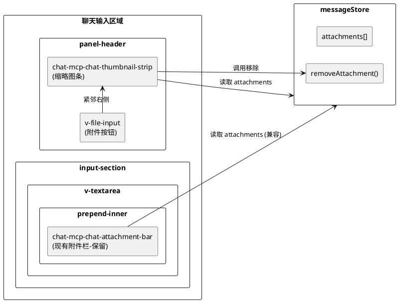

# 1. 实现模型

## 1.1 上下文视图

缩略图条组件（Thumbnail Strip）嵌入在聊天输入区域的 `v-textarea` 的 `prepend-inner` 插槽中，紧邻附件按钮（`v-file-input`）右侧。它与 `messageStore` 交互获取附件列表数据，并通过 `messageStore.removeAttachment()` 执行移除操作。



**关键定位决策**：缩略图条放置在 `panel-header` 区域，附件按钮（`v-file-input`）的右侧，而非 `v-textarea` 的 `prepend-inner` 插槽内。这样缩略图条与附件按钮处于同一行，视觉上紧邻按钮右侧，且不占用输入框内部空间。

## 1.2 服务/组件总体架构

### 组件层级

```
panel-header (div.d-flex.align-center)
├── v-file-input (附件按钮, mdi-paperclip)
├── chat-mcp-chat-thumbnail-strip (缩略图条) ← 新增
│   ├── chat-mcp-chat-thumbnail-item × N (缩略图项) ← 新增
│   └── +N 数量指示 (溢出时显示)
└── v-btn (切换面板按钮)
```

### 组件职责划分

| 组件 | 职责 | 与 spec 映射 |
|------|------|-------------|
| `chat-mcp-chat-thumbnail-strip` | 缩略图条容器，管理水平滚动、溢出数量指示、自动滚动到最新 | §5.1 缩略图展示, §5.3 溢出处理 |
| `chat-mcp-chat-thumbnail-item` | 单个缩略图项，渲染图片预览/文档图标、状态指示、悬浮交互 | §5.1 缩略图展示, §5.2 缩略图交互 |
| `messageStore` | 附件数据管理（已有，不修改数据结构） | §3.2 外部系统 |

### 与现有组件的关系

- **保留** `chat-mcp-chat-attachment-bar`：现有附件栏继续在 `v-textarea` 的 `prepend-inner` 中工作，缩略图条是新增的轻量级快速预览，两者数据源相同但展示位置和形式不同
- **渐进式迁移**：缩略图条作为附件按钮旁的快速反馈，现有附件栏提供详细信息，后续可按需整合

## 1.3 实现设计文档

### 1.3.1 chat-mcp-chat-thumbnail-strip

**模板结构**：

```html
<template id="chat-mcp-chat-thumbnail-strip-template">
  <div v-if="attachments.length > 0"
       ref="stripRef"
       class="thumbnail-strip d-flex align-center"
       @wheel.prevent="onWheel">
    <div ref="scrollContainerRef"
         class="d-flex align-center ga-1 thumbnail-scroll-container">
      <chat-mcp-chat-thumbnail-item
        v-for="attachment in attachments"
        :key="attachment.id"
        :attachment="attachment"
        @remove="$emit('remove', $event)" />
    </div>
    <div v-if="overflowCount > 0"
         class="thumbnail-overflow-badge text-caption font-weight-bold text-white bg-grey-darken-2 rounded-circle d-flex align-center justify-center">
      +{{ overflowCount }}
    </div>
  </div>
</template>
```

**组件定义**：

```javascript
const ChatThumbnailStrip = {
    template: '#chat-mcp-chat-thumbnail-strip-template',
    components: { 'chat-mcp-chat-thumbnail-item': ChatThumbnailItem },
    props: {
        attachments: { type: Array, required: true }
    },
    emits: ['remove'],
    data() {
        return {
            overflowCount: 0,
            resizeObserver: null
        };
    },
    watch: {
        attachments: {
            handler() {
                this.$nextTick(() => {
                    this.updateOverflowCount();
                    this.scrollToEnd();
                });
            },
            deep: true
        }
    },
    mounted() {
        this.resizeObserver = new ResizeObserver(() => {
            this.updateOverflowCount();
        });
        if (this.$refs.stripRef) {
            this.resizeObserver.observe(this.$refs.stripRef);
        }
    },
    beforeUnmount() {
        this.resizeObserver?.disconnect();
    },
    methods: {
        onWheel(e) {
            const container = this.$refs.scrollContainerRef;
            if (container) {
                container.scrollLeft += e.deltaY;
            }
        },
        updateOverflowCount() {
            const container = this.$refs.scrollContainerRef;
            if (!container) { this.overflowCount = 0; return; }
            const visibleWidth = this.$refs.stripRef?.clientWidth || 0;
            const totalWidth = container.scrollWidth;
            if (totalWidth <= visibleWidth) {
                this.overflowCount = 0;
                return;
            }
            const itemWidth = 36; // 32px缩略图 + 4px间距
            const hiddenWidth = totalWidth - visibleWidth;
            this.overflowCount = Math.ceil(hiddenWidth / itemWidth);
        },
        scrollToEnd() {
            const container = this.$refs.scrollContainerRef;
            if (container) {
                container.scrollTo({ left: container.scrollWidth, behavior: 'smooth' });
            }
        }
    }
};
```

### 1.3.2 chat-mcp-chat-thumbnail-item

**模板结构**：

```html
<template id="chat-mcp-chat-thumbnail-item-template">
  <v-hover v-slot="{ isHovering, props: hoverProps }">
    <div v-bind="hoverProps"
         class="thumbnail-item position-relative rounded"
         :class="{ 'on-hover': isHovering }">
      <!-- 图片缩略图 -->
      <v-img v-if="attachment.category === 'image' && attachment.thumbnail"
             :src="attachment.thumbnail"
             width="32" height="32"
             cover class="rounded" />
      <!-- 图片加载失败/无缩略图 -->
      <div v-else-if="attachment.category === 'image' && !attachment.thumbnail"
           class="d-flex align-center justify-center rounded bg-grey-lighten-3"
           style="width:32px;height:32px;">
        <v-icon size="16" color="grey">mdi-image-broken-variant</v-icon>
      </div>
      <!-- 文档图标 -->
      <div v-else
           class="d-flex align-center justify-center rounded bg-grey-lighten-3"
           style="width:32px;height:32px;">
        <v-icon size="18" :color="getDocIconColor(attachment.type)">
          {{ getDocIcon(attachment.type) }}
        </v-icon>
      </div>
      <!-- 处理中状态 -->
      <v-progress-circular v-if="attachment.status === 'processing'"
                           size="32" width="2" color="primary" indeterminate
                           style="position:absolute;top:0;left:0;" />
      <!-- 错误状态 -->
      <v-icon v-if="attachment.status === 'error'"
              size="12" color="error"
              style="position:absolute;top:-2px;right:-2px;">
        mdi-alert-circle
      </v-icon>
      <!-- 悬浮移除按钮 -->
      <v-btn v-show="isHovering"
             size="x-small" variant="flat" density="compact"
             icon="mdi-close" color="grey-darken-3"
             class="thumbnail-remove-btn"
             @click.stop="$emit('remove', attachment.id)" />
      <!-- Tooltip -->
      <v-tooltip activator="parent" location="top">
        {{ attachment.name }} ({{ formatSize(attachment.size) }})
        <template v-if="attachment.status === 'error'">
          <br />{{ attachment.errorMessage }}
        </template>
      </v-tooltip>
    </div>
  </v-hover>
</template>
```

**组件定义**：

```javascript
const ChatThumbnailItem = {
    template: '#chat-mcp-chat-thumbnail-item-template',
    props: {
        attachment: { type: Object, required: true }
    },
    emits: ['remove'],
    methods: {
        getDocIcon(type) {
            const iconMap = {
                'application/pdf': 'mdi-file-pdf-box',
                'application/msword': 'mdi-file-word-box',
                'application/vnd.openxmlformats-officedocument.wordprocessingml.document': 'mdi-file-word-box',
                'application/vnd.ms-excel': 'mdi-file-excel-box',
                'application/vnd.openxmlformats-officedocument.spreadsheetml.sheet': 'mdi-file-excel-box',
                'application/vnd.ms-powerpoint': 'mdi-file-powerpoint-box',
                'application/vnd.openxmlformats-officedocument.presentationml.presentation': 'mdi-file-powerpoint-box',
                'text/plain': 'mdi-file-document-outline',
                'text/markdown': 'mdi-language-markdown',
                'text/csv': 'mdi-file-delimited',
            };
            return iconMap[type] || 'mdi-file-document';
        },
        getDocIconColor(type) {
            const colorMap = {
                'application/pdf': 'red',
                'application/msword': 'blue',
                'application/vnd.openxmlformats-officedocument.wordprocessingml.document': 'blue',
                'application/vnd.ms-excel': 'green',
                'application/vnd.openxmlformats-officedocument.spreadsheetml.sheet': 'green',
                'application/vnd.ms-powerpoint': 'orange',
                'application/vnd.openxmlformats-officedocument.presentationml.presentation': 'orange',
                'text/plain': 'grey',
                'text/markdown': 'teal',
                'text/csv': 'green',
            };
            return colorMap[type] || 'grey';
        },
        formatSize(bytes) {
            if (bytes < 1024) return bytes + ' B';
            if (bytes < 1024 * 1024) return (bytes / 1024).toFixed(1) + ' KB';
            return (bytes / (1024 * 1024)).toFixed(1) + ' MB';
        }
    }
};
```

### 1.3.3 集成点修改

在 `panel-header` 区域中，将缩略图条插入到 `v-file-input` 和切换面板按钮之间：

**修改前**（index.html 约 374-387 行）：
```html
<div class="panel-header d-flex align-center justify-space-between px-3 py-2">
    <div class="d-flex align-center">
        <v-file-input ... />
    </div>
    <v-btn ... /> <!-- 切换面板 -->
</div>
```

**修改后**：
```html
<div class="panel-header d-flex align-center justify-space-between px-3 py-2">
    <div class="d-flex align-center">
        <v-file-input ... />
        <chat-mcp-chat-thumbnail-strip
            :attachments="messageStore.attachments"
            @remove="messageStore.removeAttachment($event)" />
    </div>
    <v-btn ... /> <!-- 切换面板 -->
</div>
```

右侧面板（约 550-560 行）做相同修改。

# 2. 接口设计

## 2.1 总体设计

缩略图条组件通过 **props** 接收附件数据，通过 **events** 向上传递用户操作，遵循 Vue 单向数据流原则。不引入新的 Store，复用 `messageStore` 已有的 `attachments` 数组和 `removeAttachment()` 方法。

## 2.2 接口清单

### chat-mcp-chat-thumbnail-strip

| 类型 | 名称 | 类型签名 | 说明 |
|------|------|---------|------|
| Prop | `attachments` | `Array<Attachment>` | 附件列表，与 messageStore.attachments 绑定 |
| Emit | `remove` | `(id: string) => void` | 移除附件事件，传递附件 ID |

### chat-mcp-chat-thumbnail-item

| 类型 | 名称 | 类型签名 | 说明 |
|------|------|---------|------|
| Prop | `attachment` | `Attachment` | 单个附件对象 |
| Emit | `remove` | `(id: string) => void` | 移除附件事件，传递附件 ID |

### Attachment 数据结构（已有，不修改）

```typescript
interface Attachment {
    id: string;           // crypto.randomUUID()
    file: File;           // 原始 File 对象
    name: string;         // 文件名
    type: string;         // MIME 类型
    size: number;         // 文件大小（字节）
    category: 'image' | 'document';  // 文件分类
    thumbnail: string;    // 图片缩略图（base64 Data URL），文档类型为空
    status: 'processing' | 'ready' | 'error';  // 处理状态
    errorMessage: string; // 错误信息
    base64Data: string;   // 图片压缩后 base64
    textContent: string;  // 文档提取文本
}
```

# 4. 数据模型

## 4.1 设计目标

1. **零新增数据结构**：完全复用 `messageStore` 已有的 `attachments` 数组和 `Attachment` 对象，缩略图条仅作为视图层组件消费现有数据
2. **响应式驱动**：缩略图条通过 Vue 的响应式系统自动感知 `attachments` 变更，无需额外事件总线或轮询

## 4.2 模型实现

### 数据流向

```
messageStore.attachments (响应式数据源)
    │
    ├──→ chat-mcp-chat-attachment-bar (现有，prepend-inner)
    │       └── chat-mcp-chat-attachment-item (80×80 详细卡片)
    │
    └──→ chat-mcp-chat-thumbnail-strip (新增，panel-header)
            └── chat-mcp-chat-thumbnail-item (32×32 紧凑缩略图)
```

### 缩略图条内部状态

缩略图条组件仅维护 UI 层面的局部状态，不持久化：

| 状态 | 类型 | 用途 | 生命周期 |
|------|------|------|---------|
| `overflowCount` | `number` | 溢出不可见的附件数量 | 组件实例 |
| `resizeObserver` | `ResizeObserver \| null` | 监听容器尺寸变化 | mounted → beforeUnmount |

### CSS 样式约束

```css
.thumbnail-strip {
    max-width: 60%;                    /* 不超过输入框宽度 60% */
    height: 32px;                      /* 与附件按钮高度一致 */
    margin-left: 8px;                  /* 与附件按钮间距 8px */
    overflow: hidden;                  /* 隐藏溢出，内部容器负责滚动 */
    flex-shrink: 1;                    /* 允许在空间不足时收缩 */
}

.thumbnail-scroll-container {
    overflow-x: auto;
    overflow-y: hidden;
    scrollbar-width: none;             /* Firefox 隐藏滚动条 */
    -ms-overflow-style: none;          /* IE/Edge 隐藏滚动条 */
}

.thumbnail-scroll-container::-webkit-scrollbar {
    display: none;                     /* Chrome/Safari 隐藏滚动条 */
}

.thumbnail-item {
    width: 32px;
    height: 32px;
    flex-shrink: 0;                    /* 缩略图项不收缩 */
    cursor: default;
}

.thumbnail-item.on-hover {
    opacity: 0.9;
}

.thumbnail-remove-btn {
    position: absolute;
    top: -6px;
    right: -6px;
    min-width: 16px;
    min-height: 16px;
    width: 16px;
    height: 16px;
    z-index: 1;
}

.thumbnail-overflow-badge {
    width: 24px;
    height: 24px;
    flex-shrink: 0;
    margin-left: 4px;
    font-size: 11px;
}
```