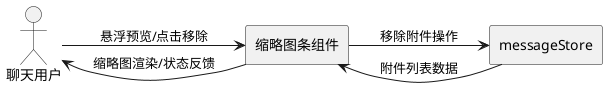
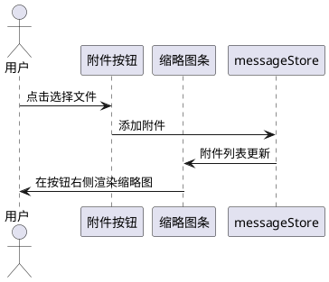
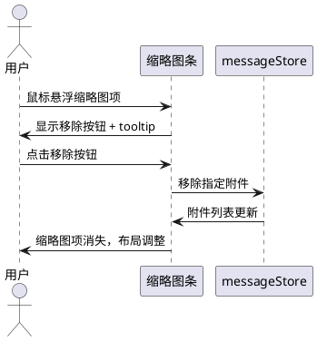
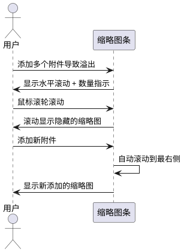

# 1. 组件定位

## 1.1 核心职责

本组件负责在附件按钮右侧展示已选中附件的缩略图，实现用户快速确认已添加附件的视觉反馈。

## 1.2 核心输入

1. **用户文件选择操作**：用户通过点击附件按钮或拖拽方式选择文件后，附件数据传入本组件
2. **用户附件移除操作**：用户移除已添加的附件，触发缩略图列表更新
3. **附件状态变更**：附件处理状态（pending/processing/ready/error）变更时，缩略图展示需同步更新

## 1.3 核心输出

1. **缩略图列表渲染**：在附件按钮右侧区域展示已选中附件的缩略图/文件图标
2. **附件数量指示**：当缩略图超出可视区域时，提供数量提示
3. **交互反馈**：缩略图支持悬浮预览、点击移除等交互

## 1.4 职责边界

1. **不负责**：文件选择器的触发（由附件按钮自身负责）
2. **不负责**：附件数据的存储与管理（由 messageStore 负责）
3. **不负责**：大图预览对话框的展示（由独立的预览组件负责）
4. **不负责**：消息发送逻辑（由消息发送模块负责）

# 2. 领域术语

**附件按钮（Attachment Button）**
: 聊天输入区域中用于触发文件选择的回形针图标按钮，缩略图展示在其右侧。

**缩略图条（Thumbnail Strip）**
: 紧邻附件按钮右侧的水平缩略图展示区域，以紧凑行内布局显示已选中附件的缩略图。

**缩略图项（Thumbnail Item）**
: 缩略图条中的单个缩略图单元，图片类型显示缩小预览图，文档类型显示文件类型图标。

# 3. 角色与边界

## 3.1 核心角色

**聊天用户**：在聊天输入区域查看已添加附件的缩略图，通过缩略图确认附件状态或移除附件。

## 3.2 外部系统

**messageStore**：提供附件列表数据（附件对象数组），缩略图组件从中读取数据并响应变更。

## 3.3 交互上下文

# 4. DFX约束

## 4.1 性能

1. 缩略图条渲染响应时间不超过 100ms，不得阻塞输入框键盘输入
2. 单个缩略图项尺寸应控制在 32×32px 以内，确保多个附件时不占用过多输入区域空间
3. 缩略图条最大宽度不超过输入框宽度的 60%，超出部分水平滚动

## 4.2 可靠性

1. 附件数据变更时缩略图条必须同步更新，不得出现数据与视图不一致
2. 缩略图生成失败时必须显示占位图标，不得出现空白或布局错乱

## 4.3 安全性

1. 缩略图仅展示本地文件内容，不涉及任何网络请求

## 4.4 可维护性

1. 缩略图条组件应与附件按钮组件松耦合，通过 props/events 通信
2. 组件命名遵循 kebab-case 规范

## 4.5 兼容性

1. 缩略图条布局必须兼容 Vuetify 的输入区域组件结构
2. 不得破坏现有附件在输入框上方展示的功能（渐进式迁移）

# 5. 核心能力

## 5.1 缩略图展示

### 5.1.1 业务规则

1. **位置规则**：附件被选中添加后，缩略图必须显示在附件按钮的右侧

   a. 验收条件：[用户添加附件] → [附件按钮右侧出现该附件的缩略图]

2. **图片缩略图规则**：图片类型附件必须显示图片内容的缩小预览

   a. 验收条件：[用户添加 jpg/png/gif/webp 图片] → [缩略图项显示图片缩小预览，保持宽高比]

3. **文档缩略图规则**：文档类型附件必须显示文件类型图标

   a. 验收条件：[用户添加 docx/pdf/xlsx 文件] → [缩略图项显示对应文件类型图标]

4. **添加顺序规则**：缩略图必须按附件添加顺序从左到右排列

   a. 验收条件：[用户依次添加文件 A、B、C] → [缩略图条从左到右显示 A→B→C]

5. **空状态规则**：当附件列表为空时，缩略图条区域不占用任何空间

   a. 验收条件：[附件列表为空] → [附件按钮右侧无缩略图区域，按钮紧邻相邻元素]

6. **禁止项**：禁止缩略图条遮挡或覆盖附件按钮本身

   a. 验收条件：[附件数量达到上限] → [缩略图条不遮挡附件按钮，按钮仍可点击]

### 5.1.2 交互流程

### 5.1.3 异常场景

1. **缩略图生成失败**

   a. 触发条件：图片文件损坏或格式异常导致无法生成缩略图

   b. 系统行为：显示默认图片占位图标替代缩略图

   c. 用户感知：缩略图项显示占位图标，不影响附件添加和消息发送

2. **附件数据延迟加载**

   a. 触发条件：附件对象已添加但缩略图数据尚未生成（status 为 processing）

   b. 系统行为：显示加载状态指示器

   c. 用户感知：缩略图项显示加载动画，处理完成后替换为缩略图

## 5.2 缩略图交互

### 5.2.1 业务规则

1. **移除交互规则**：缩略图项必须提供移除操作入口

   a. 验收条件：[用户鼠标悬浮在缩略图项上] → [显示移除按钮（×）]
   b. 验收条件：[用户点击缩略图项的移除按钮] → [该附件从列表移除，缩略图项消失]

2. **悬浮预览规则**：图片类型缩略图应当支持悬浮时显示文件名提示

   a. 验收条件：[用户鼠标悬浮在图片缩略图上] → [显示 tooltip 含文件名和文件大小]

3. **错误状态规则**：处理状态为 error 的附件缩略图必须显示错误标识

   a. 验收条件：[附件处理状态为 error] → [缩略图项叠加错误图标，tooltip 显示错误原因]

4. **禁止项**：禁止缩略图项的点击事件触发文件选择器

   a. 验收条件：[用户点击缩略图项（非移除按钮）] → [不触发文件选择对话框]

### 5.2.2 交互流程

### 5.2.3 异常场景

1. **移除时附件已被其他操作删除**

   a. 触发条件：用户点击移除按钮时，该附件已不在 messageStore 中

   b. 系统行为：忽略移除操作，缩略图条按最新数据刷新

   c. 用户感知：缩略图项自动消失，无错误提示

## 5.3 缩略图条溢出处理

### 5.3.1 业务规则

1. **水平溢出规则**：当缩略图项总宽度超出缩略图条最大宽度时，必须支持水平滚动

   a. 验收条件：[添加 8 个附件且缩略图总宽度超出区域] → [缩略图条出现水平滚动，可通过鼠标滚轮或拖拽滚动]

2. **数量指示规则**：当存在溢出不可见的缩略图时，应当在缩略图条末尾显示不可见附件数量

   a. 验收条件：[缩略图条溢出隐藏 3 个附件] → [缩略图条右侧边缘显示"+3"数量指示]

3. **滚动到最新规则**：新添加附件的缩略图应当自动滚动到可视区域

   a. 验收条件：[缩略图条已溢出时用户添加新附件] → [缩略图条自动滚动到最右侧，显示新缩略图]

4. **禁止项**：禁止缩略图条换行显示（必须保持单行水平布局）

   a. 验收条件：[附件数量超过可视区域容量] → [缩略图条保持单行，不换行，通过滚动查看]

### 5.3.2 交互流程

### 5.3.3 异常场景

1. **滚动容器尺寸为 0**

   a. 触发条件：输入区域尚未完成布局渲染时缩略图条宽度为 0

   b. 系统行为：延迟渲染缩略图条，等待布局完成

   c. 用户感知：无明显感知，缩略图在布局完成后正常显示

# 6. 数据约束

## 6.1 缩略图项数据（Thumbnail Item）

1. **attachmentId**：关联的附件 ID，必须与 messageStore 中附件对象的 id 一致
2. **thumbnailSrc**：缩略图数据源，图片类型为 base64 Data URL，文档类型为图标名称
3. **fileName**：文件名，用于 tooltip 展示，必须为非空字符串
4. **fileSize**：文件大小（字节），用于 tooltip 展示，必须大于 0
5. **category**：文件分类，必须为 "image" 或 "document" 之一，决定缩略图渲染方式
6. **status**：附件处理状态，必须为 "pending"、"processing"、"ready"、"error" 之一

## 6.2 缩略图条布局约束（Thumbnail Strip Layout）

1. **位置**：紧邻附件按钮右侧，与按钮垂直居中对齐
2. **最大宽度**：不超过输入框宽度的 60%
3. **高度**：与附件按钮高度一致（约 32px-40px）
4. **间距**：缩略图项之间水平间距为 4px
5. **与按钮间距**：缩略图条左侧与附件按钮右侧间距为 8px