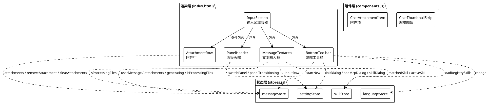
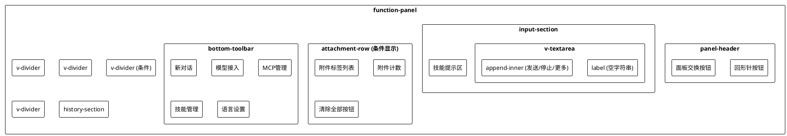

# 1. 实现模型

## 1.1 上下文视图

### 当前架构

项目采用 Vue 3 + Vuetify 技术栈，渲染层使用经典 `<script>` + 内联模板模式（非 SFC），组件定义在 `src/renderer/js/components.js`，模板直接写在 `src/renderer/index.html` 中。状态管理使用 Pinia，Store 定义在 `src/renderer/js/stores.js`。

当前输入区域布局为 **2行结构**（面板头部 + 输入区），功能面板（`function-panel`）中的输入区域包含：
- **第1行**（`panel-header`）：回形针按钮 + `ChatThumbnailStrip` 缩略图条 + 面板交换按钮
- **第2行**（`input-section`）：技能提示 + `v-textarea`（含 `prepend-inner` 中的附件标签条 `attachment-chip-strip` 和旧版 base64/documentContent 预览）+ `append-inner` 中的发送/停止/更多按钮
- **第3行**（`nav-section`）：5个功能按钮（新对话、模型接入、MCP管理、技能管理、语言设置）
- **第4行**（`history-section`）：历史记录列表

### 目标架构

将输入区域从混合行内布局重构为 **4行独立行布局**：

```
┌──────────────────────────────────────────────────┐
│ 第1行：面板头部（回形针按钮 + 面板交换按钮）        │
├──────────────────────────────────────────────────┤
│ 第2行：文本输入框（独立行，无附件展示）              │
├──────────────────────────────────────────────────┤
│ 第3行：附件行（条件显示：附件标签 + 计数 + 清除按钮） │
├──────────────────────────────────────────────────┤
│ 第4行：底部工具栏（5个功能按钮）                     │
└──────────────────────────────────────────────────┘
```

### 上下文关系图



## 1.2 服务/组件总体架构

### 组件拆分策略

由于项目使用内联模板模式（非 SFC），组件拆分在 HTML 模板层面进行。核心思路是将 `function-panel` 内的输入区域从"面板头部 + 输入区 + 导航区 + 历史区"4段式布局调整为"面板头部 + 文本输入框 + 附件行 + 底部工具栏"4行布局，同时将历史记录区移至工具栏下方保持不变。

### 布局变更对照

| 区域 | 变更前 | 变更后 |
|------|--------|--------|
| 面板头部 | 回形针 + ChatThumbnailStrip + 交换按钮 | 回形针 + 交换按钮（移除 ChatThumbnailStrip） |
| 文本输入框 | prepend-inner 含附件标签条 + 旧版预览 | 独立行，prepend-inner 为空，label 为空字符串（附件计数已在独立附件行展示） |
| 附件行 | 不存在（附件在输入框内） | 新增独立行：附件标签 + 计数 + 清除按钮 |
| 底部工具栏 | nav-section（5按钮） | 同 nav-section（5按钮），位置上移至附件行下方 |
| 历史记录 | history-section | 保持不变 |

### 架构层次图



## 1.3 实现设计文档

### 1.3.1 面板头部重构

**变更内容**：从 `panel-header` 中移除 `ChatThumbnailStrip` 组件，仅保留回形针按钮和面板交换按钮。

**实现方式**：
- 删除 `panel-header` 内的 `<chat-mcp-chat-thumbnail-strip>` 元素
- 回形针按钮和交换按钮保持现有逻辑不变
- 回形针按钮的 `:disabled` 绑定 `messageStore.isProcessingFiles` 保持不变
- 面板交换按钮的 `@click` 防抖逻辑保持不变

**影响范围**：`index.html` 中左右两个面板的 `panel-header` 区域均需同步修改。

### 1.3.2 文本输入框独立行

**变更内容**：将 `v-textarea` 的 `prepend-inner` 插槽清空，移除附件标签条和旧版 base64/documentContent 预览。

**实现方式**：
- 删除 `v-textarea` 的 `<template v-slot:prepend-inner>` 整个插槽内容
- `label` 属性改为空字符串 `''`，不再显示附件计数提示（附件计数已在独立附件行中展示，无需在输入框内重复显示）
- `append-inner` 插槽（发送/停止/更多按钮）保持不变
- 技能提示区（`skillStore.activeSkill` / `skillStore.matchedSkill`）保持在 `v-textarea` 上方不变

**影响范围**：`index.html` 中左右两个面板的 `input-section` 区域。

### 1.3.3 附件独立行展示

**变更内容**：在 `input-section` 与 `bottom-toolbar`（原 `nav-section`）之间新增附件行。

**实现方式**：
- 在 `input-section` 的 `</div>` 闭合标签之后、`<v-divider>` 之前，新增附件行区域
- 附件行使用 `v-if="messageStore.attachments.length > 0"` 条件渲染
- 附件行结构：
  - 外层容器：`<div class="attachment-row d-flex align-center flex-wrap ga-1 px-3 py-2">`
  - 附件标签列表：`<v-chip v-for="attachment in messageStore.attachments" ...>`（复用现有 `attachment-chip-strip` 中的 Chip 逻辑）
  - 附件计数提示：`<span class="text-caption text-grey ml-2">{{ $t('$vuetify.dataIterator.attachment.attachedCount', { count: messageStore.attachments.length }) }}</span>`
  - 清除全部按钮：`<v-btn size="x-small" variant="text" color="grey" class="ml-auto" @click="messageStore.clearAttachments()">`（复用现有逻辑）
- 附件行下方添加条件分隔线：`<v-divider v-if="messageStore.attachments.length > 0"></v-divider>`
- 附件行最大高度约束：通过 CSS `max-height: 120px; overflow-y: auto;` 实现

**附件标签 Chip 规格**：
- `size="x-small"`
- `variant="tonal"`
- `closable`
- `@click:close="messageStore.removeAttachment(attachment.id)"`
- 内容：`<v-icon start size="x-small">{{ messageStore.getAttachmentIcon(attachment) }}</v-icon>` + `<span class="text-truncate" style="max-width:120px;">{{ attachment.name }}</span>`

**影响范围**：`index.html` 中左右两个面板。

### 1.3.4 底部工具栏

**变更内容**：将现有 `nav-section` 重命名为 `bottom-toolbar`，按钮逻辑保持不变。

**实现方式**：
- 将 `nav-section` 的 class 名改为 `bottom-toolbar`
- 5个按钮（新对话、模型接入、MCP管理、技能管理、语言设置）的 `@click`、`prepend-icon`、`v-tooltip` 逻辑完全保持不变
- 按钮样式保持 `variant="tonal"` 和 `size="small"` 不变
- 按钮居中对齐保持 `d-flex align-center justify-center ga-2` 不变

**影响范围**：`index.html` 中左右两个面板的 `nav-section` → `bottom-toolbar`。

### 1.3.5 布局层级关系

**变更内容**：调整 `function-panel` 内各区域的顺序和分隔线。

**实现方式**：

变更前顺序：
1. `panel-header` → `<v-divider>`
2. `input-section`（含 prepend-inner 附件）→ `<v-divider>`
3. `nav-section` → `<v-divider>`
4. `history-section`

变更后顺序：
1. `panel-header`（移除 ChatThumbnailStrip）→ `<v-divider>`
2. `input-section`（prepend-inner 为空）→ `<v-divider>`
3. `attachment-row`（条件显示）→ `<v-divider>`（条件显示）
4. `bottom-toolbar`（原 nav-section）→ `<v-divider>`
5. `history-section`

**关键约束**：
- 附件行仅在 `messageStore.attachments.length > 0` 时渲染，空状态不占空间
- 附件行与底部工具栏之间的分隔线也是条件渲染
- 双面板（左/右）布局必须完全一致

# 2. 接口设计

## 2.1 总体设计

本次重构为纯 UI 布局调整，不新增组件接口，不修改 Store 接口。所有变更均在 `index.html` 模板层面完成，复用现有 Store 方法和组件。

**核心原则**：
- 不修改 `components.js` 中的组件定义
- 不修改 `stores.js` 中的 Store 接口
- 不修改 `app.js` 中的应用逻辑
- 仅调整 `index.html` 中的模板结构和 CSS 样式

## 2.2 接口清单

### 2.2.1 复用的 Store 方法

| 方法 | 所属 Store | 用途 | 变更 |
|------|-----------|------|------|
| `messageStore.attachments` | messageStore | 附件列表数据 | 无 |
| `messageStore.removeAttachment(id)` | messageStore | 移除单个附件 | 无 |
| `messageStore.clearAttachments()` | messageStore | 清除所有附件 | 无 |
| `messageStore.getAttachmentIcon(attachment)` | messageStore | 获取附件图标 | 无 |
| `messageStore.isProcessingFiles` | messageStore | 文件处理状态 | 无 |
| `messageStore.userMessage` | messageStore | 用户输入文本 | 无 |
| `messageStore.generating` | messageStore | 生成状态 | 无 |
| `messageStore.handleKeydown` | messageStore | 键盘事件 | 无 |
| `messageStore.sendMessage` | messageStore | 发送消息 | 无 |
| `messageStore.startNew()` | messageStore | 新对话 | 无 |
| `settingStore.switchPanel()` | settingStore | 面板切换 | 无 |
| `settingStore.panelTransitioning` | settingStore | 面板切换中 | 无 |
| `settingStore.initDialog` | settingStore | 打开配置对话框 | 无 |
| `settingStore.addMcpDialog` | settingStore | MCP对话框 | 无 |
| `settingStore.skillDialog` | settingStore | 技能对话框 | 无 |
| `skillStore.activeSkill` | skillStore | 激活的技能 | 无 |
| `skillStore.matchedSkill` | skillStore | 匹配的技能 | 无 |
| `skillStore.loadRegistrySkills()` | skillStore | 加载技能列表 | 无 |
| `languageStore.change(value)` | languageStore | 切换语言 | 无 |

### 2.2.2 复用的 i18n 键

| i18n 键 | 用途 | 变更 |
|---------|------|------|
| `$vuetify.dataIterator.attachment.addTooltip` | 附件按钮提示 | 无 |
| `$vuetify.dataIterator.attachment.attachedCount` | 附件计数提示 | 无 |
| `$vuetify.dataIterator.g.new` | 新对话 | 无 |
| `$vuetify.dataIterator.g.clearAll` | 清除全部 | 无 |
| `$vuetify.dataIterator.i.title` | 模型接入 | 无 |
| `$vuetify.dataIterator.mcp.title` | MCP管理 | 无 |
| `$vuetify.dataIterator.skill.title` | 技能管理 | 无 |
| `$vuetify.dataIterator.l.title` | 语言设置 | 无 |
| `$vuetify.dataIterator.skill.clickToActivate` | 技能激活提示 | 无 |

### 2.2.3 移除的组件引用

| 组件 | 移除原因 |
|------|---------|
| `<chat-mcp-chat-thumbnail-strip>` | 面板头部不再展示缩略图条，附件展示移至独立附件行 |

### 2.2.4 移除的模板代码

| 代码段 | 移除原因 |
|--------|---------|
| `v-textarea` 的 `prepend-inner` 插槽 | 附件标签条和旧版预览移至独立附件行 |
| `v-container` 内的 `base64` / `documentContent` 预览 | 旧版附件预览逻辑，已被新附件系统替代 |

# 4. 数据模型

## 4.1 设计目标

本次重构不新增数据模型，仅复用现有 `messageStore.attachments` 数组。数据模型设计目标为：
- 确保附件行与现有附件数据流的无缝对接
- 明确附件行展示所需的数据字段映射

## 4.2 模型实现

### 4.2.1 附件对象模型（现有，无变更）

```typescript
/** 附件对象 - 定义在 messageStore 中 */
interface Attachment {
  /** 唯一标识 */
  id: string;
  /** 原始 File 对象 */
  file: File;
  /** 文件名 */
  name: string;
  /** MIME 类型 */
  type: string;
  /** 文件大小（字节） */
  size: number;
  /** 文件分类：'image' | 'document' */
  category: string;
  /** 缩略图 Base64 */
  thumbnail: string;
  /** 处理状态：'processing' | 'ready' | 'error' */
  status: string;
  /** 错误信息 */
  errorMessage: string;
  /** 图片 Base64 数据 */
  base64Data: string;
  /** 文档文本内容 */
  textContent: string;
}
```

### 4.2.2 附件行展示数据映射

| 展示元素 | 数据来源 | 计算方式 |
|---------|---------|---------|
| 附件标签列表 | `messageStore.attachments` | 直接遍历 |
| 附件标签图标 | `messageStore.getAttachmentIcon(attachment)` | 根据 category/type 映射 |
| 附件标签文件名 | `attachment.name` | 直接取值，截断至120px |
| 附件标签关闭 | `messageStore.removeAttachment(attachment.id)` | 调用 Store 方法 |
| 附件计数 | `messageStore.attachments.length` | 数组长度 |
| 附件行可见性 | `messageStore.attachments.length > 0` | 条件渲染 |
| 清除全部 | `messageStore.clearAttachments()` | 调用 Store 方法 |
| 输入框 label | 固定为空字符串 `''` | 不再显示附件计数（已移至独立附件行） |

### 4.2.3 底部工具栏按钮数据映射

| 按钮 | 图标 | 点击动作 | Tooltip i18n 键 |
|------|------|---------|-----------------|
| 新对话 | `mdi-plus-circle-outline` | `messageStore.startNew()` | `$vuetify.dataIterator.g.new` |
| 模型接入 | `mdi-api` | `settingStore.initDialog` | `$vuetify.dataIterator.i.title` |
| MCP管理 | `mdi-lan-connect` | `settingStore.addMcpDialog = true; settingStore.mcpTab = 'add-server'` | `$vuetify.dataIterator.mcp.title` |
| 技能管理 | `mdi-auto-fix` | `settingStore.skillDialog = true; settingStore.skillTab = 'registry'; skillStore.loadRegistrySkills()` | `$vuetify.dataIterator.skill.title` |
| 语言设置 | `mdi-translate` | `v-menu` 下拉菜单 | `$vuetify.dataIterator.l.title` |