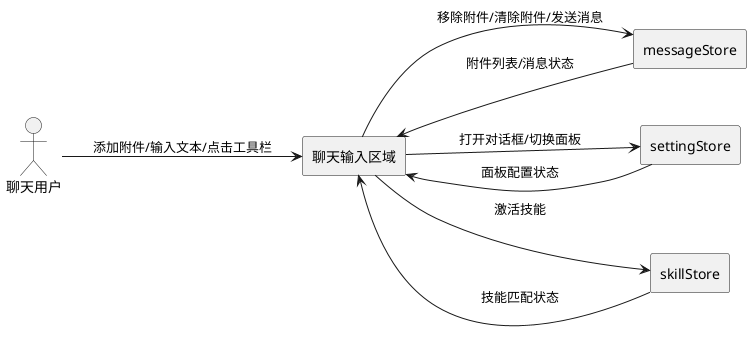
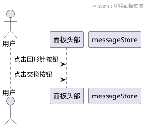
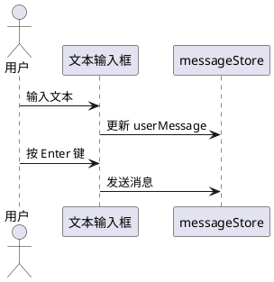
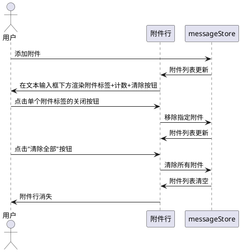
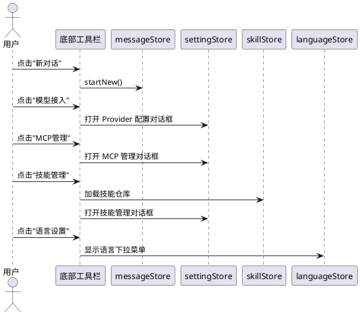
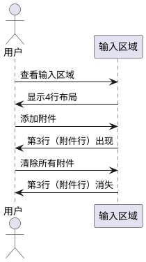

# 1. 组件定位

## 1.1 核心职责

本组件负责聊天输入区域的UI布局重构，将附件展示、文本输入、工具栏从混合行内布局调整为分层独立行布局。

## 1.2 核心输入

1. **用户文件选择操作**：用户通过点击回形针按钮或拖拽方式添加附件，附件数据传入输入区域
2. **用户文本输入操作**：用户在文本输入框中键入消息内容
3. **用户工具栏操作**：用户点击底部工具栏按钮（新对话、模型接入、MCP管理、技能管理、语言设置）
4. **面板切换操作**：用户点击面板左右交换按钮，切换聊天面板与功能面板的位置

## 1.3 核心输出

1. **分层布局渲染**：将输入区域从2行布局重构为4行独立布局
2. **附件独立行展示**：附件列表与附件计数在文本输入框下方独立一行展示
3. **附件全部清除按钮**：在附件行提供一键清除所有附件的操作入口
4. **底部工具栏**：在附件行下方新增包含5个功能按钮的工具栏行

## 1.4 职责边界

1. **不负责**：附件数据的存储与管理（由 messageStore 负责）
2. **不负责**：消息发送逻辑（由消息发送模块负责）
3. **不负责**：文件选择器的触发与文件校验（由文件上传模块负责）
4. **不负责**：工具栏按钮对应的对话框内容（由各对话框组件负责）
5. **不负责**：面板切换的动画与状态管理（由 settingStore 负责）

# 2. 领域术语

**输入区域（Input Section）**
: 聊天界面中包含附件操作、文本输入和功能按钮的区域，位于面板头部与导航栏之间。

**面板头部（Panel Header）**
: 输入区域顶部的行，包含回形针附件按钮和面板左右交换按钮。

**附件行（Attachment Row）**
: 文本输入框下方独立展示已添加附件列表、附件计数和全部清除按钮的行。

**底部工具栏（Bottom Toolbar）**
: 附件行下方包含新对话、模型接入、MCP管理、技能管理、语言设置按钮的功能行。

**面板左右交换按钮（Panel Switch Button）**
: 位于面板头部右侧的按钮，点击后交换聊天面板与功能面板的左右位置。

**附件全部清除按钮（Clear All Attachments Button）**
: 位于附件行右侧的按钮，点击后清除所有已添加的附件。

# 3. 角色与边界

## 3.1 核心角色

**聊天用户**：在聊天输入区域添加附件、输入文本、使用工具栏功能，通过分层布局更清晰地操作各功能区域。

## 3.2 外部系统

**messageStore**：提供附件列表数据、用户输入文本、生成状态等，输入区域从中读取数据并响应变更。

**settingStore**：提供面板配置状态（面板位置、对话框开关等），工具栏按钮触发其状态变更。

**skillStore**：提供技能匹配与激活状态，输入区域展示技能相关提示。

## 3.3 交互上下文

# 4. DFX约束

## 4.1 性能

1. 布局重构后输入区域渲染响应时间不超过 100ms，不得出现布局闪烁或重排
2. 附件行展开/收起动画过渡时间不超过 200ms
3. 底部工具栏按钮响应点击时间不超过 50ms

## 4.2 可靠性

1. 附件数据变更时附件行必须同步更新，不得出现数据与视图不一致
2. 面板切换时输入区域布局必须保持稳定，不得出现元素重叠或丢失

## 4.3 安全性

1. 附件全部清除按钮必须提供二次确认或可撤销机制，防止误操作导致附件丢失

## 4.4 可维护性

1. 输入区域各层（面板头部、文本输入、附件行、底部工具栏）应保持结构独立，通过 props/events 通信
2. 布局变更不得影响现有组件（ChatThumbnailStrip、ChatAttachmentItem 等）的接口契约

## 4.5 兼容性

1. 布局重构必须同时适用于聊天面板（activePanel === 'chat'）和功能面板两种视图
2. 不得破坏现有拖拽上传、键盘快捷键（Ctrl+Alt+A）等功能
3. 不得破坏现有技能匹配提示在文本输入框内的展示

# 5. 核心能力

## 5.1 面板头部布局

### 5.1.1 业务规则

1. **头部行组成规则**：面板头部必须仅包含回形针附件按钮和面板左右交换按钮

   a. 验收条件：[输入区域渲染完成] → [面板头部行仅显示回形针按钮和交换按钮，无其他元素]

2. **按钮排列规则**：回形针按钮必须在左侧，面板左右交换按钮必须在右侧

   a. 验收条件：[输入区域渲染完成] → [回形针按钮位于头部行左端，交换按钮位于头部行右端]

3. **缩略图条移除规则**：面板头部行中不得再显示缩略图条（ChatThumbnailStrip）

   a. 验收条件：[用户添加附件后] → [面板头部行不显示缩略图条，缩略图条不在该行出现]

### 5.1.2 交互流程

### 5.1.3 异常场景

1. **文件处理中点击附件按钮**

   a. 触发条件：附件正在处理（isProcessingFiles 为 true）时用户点击回形针按钮

   b. 系统行为：按钮置为禁用状态，不触发文件选择器

   c. 用户感知：回形针按钮灰色不可点击

## 5.2 文本输入框独立行

### 5.2.1 业务规则

1. **独立行规则**：文本输入框必须占据独立的一行，不得与附件展示区域同行

   a. 验收条件：[输入区域渲染完成] → [文本输入框独占一整行，左侧无附件缩略图，右侧仅有发送/操作按钮]

2. **附件标签移除规则**：文本输入框的 prepend-inner 插槽中不得再展示附件标签条（attachment-chip-strip）

   a. 验收条件：[用户添加附件后] → [文本输入框内部顶部不显示附件标签条]

3. **旧版附件展示移除规则**：文本输入框的 prepend-inner 插槽中不得再展示旧版 base64/documentContent 图片和文档预览

   a. 验收条件：[用户添加图片或文档附件后] → [文本输入框内部不显示旧版图片预览或文档图标]

4. **标签提示规则**：文本输入框的 label 必须为空字符串，不得显示附件计数提示（附件计数已在独立附件行中展示，无需在输入框内重复显示）

   a. 验收条件：[用户添加 3 个附件后] → [文本输入框 label 为空，不显示"已添加 3 个附件"]

   b. 验收条件：[附件列表为空时] → [文本输入框 label 为空]

5. **发送按钮规则**：文本输入框右侧的 append-inner 区域保持现有发送/停止/更多操作按钮不变

   a. 验收条件：[用户输入文本后] → [文本输入框右侧显示发送按钮]

   b. 验收条件：[正在生成回复时] → [文本输入框右侧显示停止按钮]

### 5.2.2 交互流程

### 5.2.3 异常场景

1. **附件处理中发送消息**

   a. 触发条件：附件正在处理（isProcessingFiles 为 true）时用户尝试发送

   b. 系统行为：发送按钮置灰禁用

   c. 用户感知：发送按钮不可点击，显示处理中状态

## 5.3 附件独立行展示

### 5.3.1 业务规则

1. **附件行位置规则**：附件展示区域必须位于文本输入框下方、底部工具栏上方，独占一行

   a. 验收条件：[用户添加附件后] → [文本输入框下方出现附件行，附件行位于工具栏上方]

2. **附件行内容规则**：附件行必须包含附件标签列表、附件计数和全部清除按钮

   a. 验收条件：[用户添加 2 个附件后] → [附件行从左到右依次显示：附件标签列表、附件计数提示、全部清除按钮]

3. **附件标签规则**：每个附件必须以标签（Chip）形式展示，包含文件类型图标和文件名

   a. 验收条件：[用户添加 docx 附件后] → [附件行显示一个 Chip，含 Word 图标和文件名]

   b. 验收条件：[用户点击 Chip 的关闭按钮后] → [该附件从列表移除，Chip 消失]

4. **附件计数规则**：附件行应显示当前附件数量提示

   a. 验收条件：[用户添加 3 个附件后] → [附件行显示"已添加 3 个附件"提示]

5. **全部清除按钮规则**：附件行右侧必须提供全部清除按钮，点击后清除所有附件

   a. 验收条件：[附件行存在附件时] → [附件行右侧显示"清除全部"按钮]

   b. 验收条件：[用户点击"清除全部"按钮后] → [所有附件被移除，附件行消失]

6. **空状态规则**：当附件列表为空时，附件行不得占用任何空间

   a. 验收条件：[附件列表为空时] → [文本输入框与底部工具栏之间无附件行区域]

7. **附件行对齐规则**：附件标签列表左对齐，全部清除按钮右对齐

   a. 验收条件：[附件行存在多个附件时] → [标签列表靠左排列，全部清除按钮靠右对齐]

8. **禁止项**：禁止附件行与文本输入框同行展示

   a. 验收条件：[用户添加附件后] → [附件展示在文本输入框下方的独立行，不在输入框内部]

### 5.3.2 交互流程

### 5.3.3 异常场景

1. **清除全部时附件正在处理**

   a. 触发条件：部分附件仍在处理中时用户点击"清除全部"

   b. 系统行为：立即清除所有附件（包括处理中的），重置处理状态

   c. 用户感知：所有附件消失，处理中状态重置

2. **附件行渲染时附件数据为空**

   a. 触发条件：附件列表在渲染过程中被清空

   b. 系统行为：附件行不渲染或立即移除

   c. 用户感知：附件行区域不占空间，布局无缝衔接

## 5.4 底部工具栏

### 5.4.1 业务规则

1. **工具栏位置规则**：底部工具栏必须位于附件行下方，独占一行

   a. 验收条件：[输入区域渲染完成] → [底部工具栏位于附件行（或文本输入框，当无附件时）下方]

2. **工具栏按钮组成规则**：底部工具栏必须包含以下5个按钮，从左到右依次排列

   a. 验收条件：[输入区域渲染完成] → [底部工具栏从左到右依次显示：新对话、模型接入、MCP管理、技能管理、语言设置]

3. **新对话按钮规则**：点击后必须触发新对话操作

   a. 验收条件：[用户点击"新对话"按钮后] → [当前对话归档到历史记录，开始新对话]

4. **模型接入按钮规则**：点击后必须打开模型配置对话框

   a. 验收条件：[用户点击"模型接入"按钮后] → [弹出 Provider 配置对话框]

5. **MCP管理按钮规则**：点击后必须打开 MCP 管理对话框

   a. 验收条件：[用户点击"MCP管理"按钮后] → [弹出 MCP 管理对话框，默认显示添加服务器标签页]

6. **技能管理按钮规则**：点击后必须打开技能管理对话框

   a. 验收条件：[用户点击"技能管理"按钮后] → [弹出技能管理对话框，默认显示技能仓库标签页]

7. **语言设置按钮规则**：点击后必须显示语言选择下拉菜单

   a. 验收条件：[用户点击"语言设置"按钮后] → [显示包含"简体中文"和"English"选项的下拉菜单]

   b. 验收条件：[用户选择"English"后] → [界面语言切换为英文]

8. **按钮样式规则**：所有工具栏按钮必须使用 variant="tonal" 样式，尺寸为 small

   a. 验收条件：[输入区域渲染完成] → [所有工具栏按钮使用 tonal 变体样式，尺寸统一为 small]

9. **按钮图标规则**：每个按钮必须包含前置图标（prepend-icon）

   a. 验收条件：[输入区域渲染完成] → [新对话按钮显示 mdi-plus-circle-outline 图标，模型接入按钮显示 mdi-api 图标，MCP管理按钮显示 mdi-lan-connect 图标，技能管理按钮显示 mdi-auto-fix 图标，语言设置按钮显示 mdi-translate 图标]

10. **按钮提示规则**：每个按钮必须提供底部 tooltip 提示

    a. 验收条件：[用户鼠标悬浮在按钮上] → [显示对应功能的 tooltip 提示文字]

11. **工具栏对齐规则**：底部工具栏按钮必须居中对齐

    a. 验收条件：[输入区域渲染完成] → [5个按钮在工具栏行内居中排列]

12. **禁止项**：禁止底部工具栏按钮与导航栏（nav-section）按钮功能不一致

    a. 验收条件：[底部工具栏的"新对话"按钮与导航栏的"新对话"按钮功能完全一致]

### 5.4.2 交互流程

### 5.4.3 异常场景

1. **正在生成时点击新对话**

   a. 触发条件：AI 正在生成回复时用户点击"新对话"按钮

   b. 系统行为：先停止生成，再执行新对话操作

   c. 用户感知：生成停止，当前对话归档，开始新对话

2. **语言切换失败**

   a. 触发条件：语言资源文件加载异常

   b. 系统行为：保持当前语言不变

   c. 用户感知：界面语言未变更，无错误提示

## 5.5 布局层级关系

### 5.5.1 业务规则

1. **四行布局规则**：输入区域必须按照以下顺序从上到下排列为4个独立行

   - 第1行：面板头部（回形针按钮 + 面板左右交换按钮）
   - 第2行：文本输入框
   - 第3行：附件行（附件标签 + 附件计数 + 全部清除按钮，仅在有附件时显示）
   - 第4行：底部工具栏（新对话 + 模型接入 + MCP管理 + 技能管理 + 语言设置）

   a. 验收条件：[输入区域渲染完成] → [从上到下依次显示面板头部、文本输入框、附件行（如有附件）、底部工具栏]

2. **行间分隔规则**：各行之间必须使用分隔线（v-divider）分隔

   a. 验收条件：[输入区域渲染完成] → [面板头部与文本输入框之间、文本输入框与附件行之间、附件行与底部工具栏之间均有分隔线]

3. **附件行动态显示规则**：第3行（附件行）仅在有附件时显示，无附件时不占空间

   a. 验收条件：[附件列表为空时] → [文本输入框与底部工具栏之间无附件行，也无多余间距]

   b. 验收条件：[用户添加附件后] → [文本输入框与底部工具栏之间出现附件行]

   c. 验收条件：[用户清除所有附件后] → [附件行消失，文本输入框与底部工具栏直接相邻]

4. **双面板一致性规则**：聊天面板和功能面板中的输入区域布局必须完全一致

   a. 验收条件：[切换面板后] → [输入区域布局结构不变，4行布局保持一致]

### 5.5.2 交互流程

### 5.5.3 异常场景

1. **面板切换时布局错乱**

   a. 触发条件：用户快速连续点击面板交换按钮

   b. 系统行为：面板切换动画期间禁用交换按钮，防止重复触发

   c. 用户感知：交换按钮在动画期间不可点击

# 6. 数据约束

## 6.1 附件行数据（Attachment Row）

1. **attachments**：附件对象数组，来源为 messageStore.attachments，数组长度为 0-10
2. **attachmentCount**：附件数量，等于 attachments.length，用于显示"已添加 N 个附件"提示
3. **hasAttachments**：是否存在附件，等于 attachments.length > 0，决定附件行是否显示

## 6.2 底部工具栏按钮数据（Bottom Toolbar Button）

1. **label**：按钮显示文本，必须通过 i18n 国际化，支持中英文
2. **icon**：按钮前置图标，必须为有效的 MDI 图标名称
3. **tooltip**：按钮悬浮提示文本，必须通过 i18n 国际化
4. **action**：按钮点击触发的操作，必须为有效的函数引用

## 6.3 布局层级约束（Layout Hierarchy）

1. **行顺序**：面板头部 → 文本输入框 → 附件行（条件显示）→ 底部工具栏，顺序固定不可调换
2. **附件行可见性**：仅当 messageStore.attachments.length > 0 时附件行可见
3. **分隔线**：每两个相邻行之间必须存在一条水平分隔线
4. **附件行最大高度**：附件行内容超出时必须支持换行显示，最大高度不超过 120px，超出部分滚动