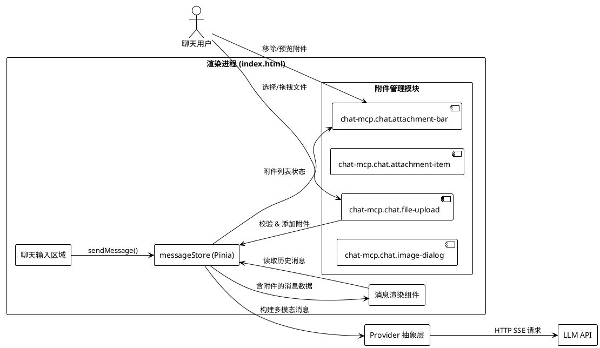
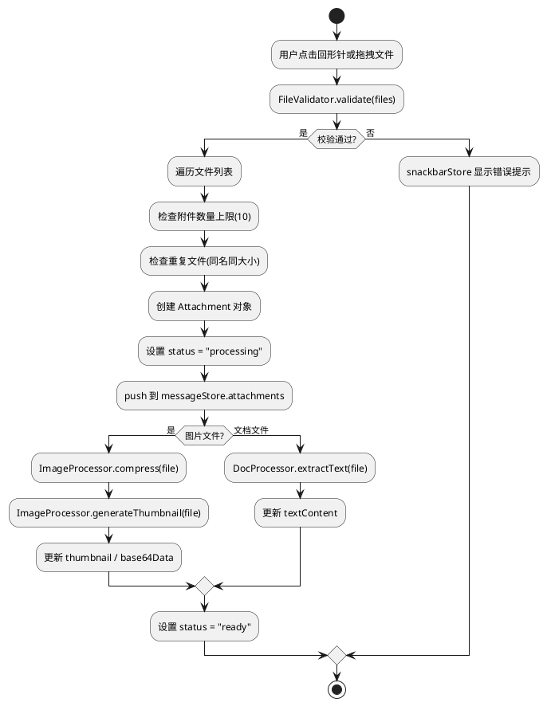
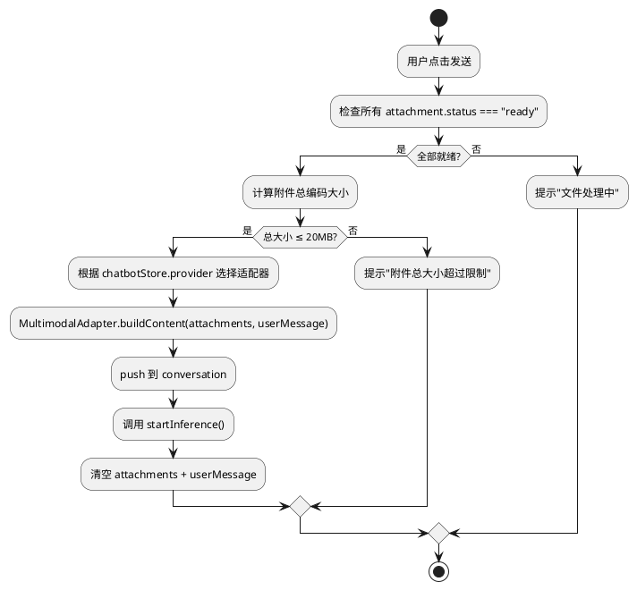
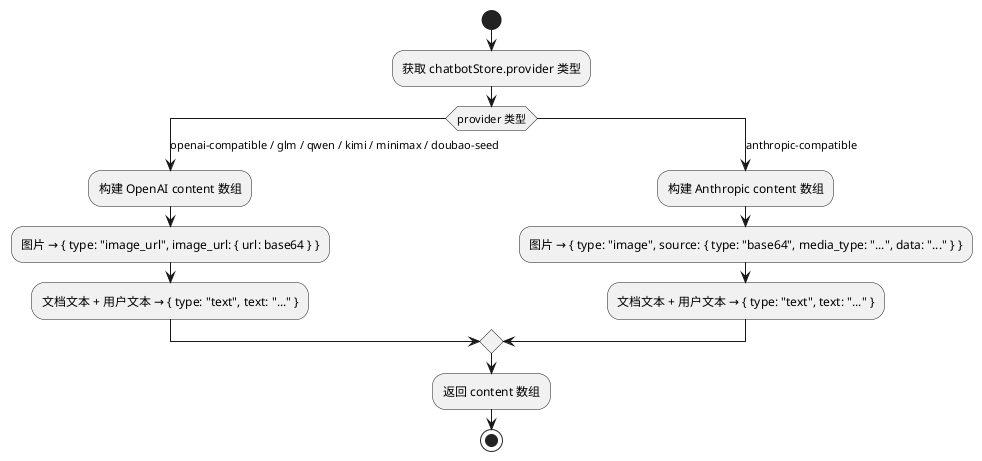

# 文件附件上传功能 — 实现方案设计

# 1. 实现模型

## 1.1 上下文视图

本功能在现有 chat-mcp Electron 应用的聊天对话中引入多文件附件管理能力。核心交互发生在渲染进程（`index.html`）内，附件数据仅存于内存（Pinia Store），不落盘持久化。



### 外部依赖

| 依赖 | 用途 | 来源 |
|------|------|------|
| `mammoth.browser.js` | 解析 .docx 文件提取文本 | 已内置于 `src/lib/js/` |
| Canvas API | 图片压缩/缩略图生成 | 浏览器原生 |
| FileReader API | 读取本地文件内容 | 浏览器原生 |
| Vuetify `v-file-input` | 文件选择器 UI | 已引入 |

## 1.2 服务/组件总体架构

### 架构分层

```
┌─────────────────────────────────────────────────────┐
│                   UI 层 (Vuetify)                    │
│  ┌──────────────┐ ┌──────────────┐ ┌─────────────┐  │
│  │ attachment-  │ │ attachment-  │ │ file-upload │  │
│  │    bar       │ │    item      │ │   (已有)     │  │
│  └──────┬───────┘ └──────┬───────┘ └──────┬──────┘  │
│         │                │                │          │
├─────────┼────────────────┼────────────────┼──────────┤
│         ▼                ▼                ▼          │
│              messageStore (Pinia)                    │
│  ┌─────────────────────────────────────────────┐    │
│  │  attachments: Attachment[]  (新增)           │    │
│  │  images / base64 / documentContent  (已有)   │    │
│  │  + addAttachment() / removeAttachment()      │    │
│  │  + clearAttachments() / buildContent()       │    │
│  └──────────────────────┬──────────────────────┘    │
│                         │                            │
├─────────────────────────┼────────────────────────────┤
│              文件处理服务层                           │
│  ┌──────────────┐ ┌──────────────┐ ┌──────────────┐ │
│  │ ImageProcessor│ │ DocProcessor │ │ FileValidator│ │
│  │ (压缩/缩略图) │ │ (文本提取)   │ │ (类型/大小)  │ │
│  └──────────────┘ └──────────────┘ └──────────────┘ │
│                         │                            │
├─────────────────────────┼────────────────────────────┤
│              Provider 适配层                          │
│  ┌──────────────────────────────────────────────┐   │
│  │ MultimodalAdapter                            │   │
│  │ - buildOpenAIContent(attachments, text)      │   │
│  │ - buildAnthropicContent(attachments, text)   │   │
│  │ - buildFallbackContent(attachments, text)    │   │
│  └──────────────────────────────────────────────┘   │
└─────────────────────────────────────────────────────┘
```

### 核心设计决策

1. **附件列表存储在 messageStore**：与现有 `images`/`base64`/`documentContent` 并列，新增 `attachments` 数组，保持 Store 架构一致性
2. **渐进式迁移**：保留现有单文件上传字段（`images`/`base64`/`documentContent`）的兼容性，新功能通过 `attachments` 数组实现，发送时优先使用 `attachments`
3. **文件处理与消息发送解耦**：文件校验、压缩、解析在添加时异步完成，状态标记在 Attachment 对象上，发送时仅检查状态
4. **Provider 适配在消息构建层**：在 `sendMessage()` 中根据当前 Provider 类型调用不同的内容构建方法

## 1.3 实现设计文档

### 1.3.1 附件添加流程



### 1.3.2 附件消息发送流程



### 1.3.3 Provider 多模态适配



# 2. 接口设计

## 2.1 总体设计

本功能不引入新的独立模块/服务，所有接口均为 `messageStore` 的扩展方法和新增的纯函数工具。

### 接口分层

| 层次 | 职责 | 位置 |
|------|------|------|
| **UI 组件接口** | 附件预览/管理交互 | `index.html` 模板 |
| **Store 接口** | 附件状态管理、消息构建 | `messageStore` 扩展 |
| **文件处理接口** | 校验、压缩、解析 | 纯函数（内联在 `<script>` 中） |
| **Provider 适配接口** | 多模态消息格式转换 | 纯函数（内联在 `<script>` 中） |

## 2.2 接口清单

### 2.2.1 messageStore 扩展

#### State 扩展

```typescript
// messageStore.state 新增字段
{
  // === 新增 ===
  attachments: Attachment[],       // 附件列表（多文件）
  isProcessingFiles: boolean,      // 是否有文件正在处理中

  // === 已有（保留兼容） ===
  images: any[],                   // v-file-input 绑定（改为多文件模式）
  base64: string,                  // 兼容旧逻辑
  documentContent: string,         // 兼容旧逻辑
  documentType: string,            // 兼容旧逻辑
  userMessage: string,
  conversation: any[],
  generating: boolean
}
```

#### Action 扩展

```typescript
// messageStore.actions 新增方法

/** 添加附件（含校验） */
addAttachment(file: File): void
  // 1. 调用 FileValidator.validate(file) 校验
  // 2. 检查 attachments.length < 10
  // 3. 检查重复文件
  // 4. 创建 Attachment 对象，push 到 attachments
  // 5. 异步处理文件（压缩/解析），更新 status

/** 移除指定附件 */
removeAttachment(id: string): void
  // 从 attachments 中过滤掉 id 匹配的项

/** 清空所有附件 */
clearAttachments(): void
  // 清空 attachments 数组，重置 images

/** 构建多模态消息内容 */
buildMultimodalContent(text: string): string | ContentItem[]
  // 根据 chatbotStore.provider 类型调用对应适配器
  // 返回 OpenAI/Anthropic 兼容的 content 数组或纯文本
```

#### sendMessage() 修改

```typescript
// 修改现有 sendMessage() 方法
sendMessage(): void {
  const hasAttachments = this.attachments.length > 0;
  const hasText = !!this.userMessage;
  const hasLegacyFile = !!this.base64 || !!this.documentContent;

  if (!hasText && !hasAttachments && !hasLegacyFile) return;

  // 检查文件处理状态
  if (this.isProcessingFiles) {
    snackbarStore.showWarningMessage('文件处理中，请稍候...');
    return;
  }

  // 检查附件总大小
  if (hasAttachments && this.getTotalEncodedSize() > 20 * 1024 * 1024) {
    snackbarStore.showWarningMessage('附件总大小超过限制，请减少附件');
    return;
  }

  let content;
  if (hasAttachments) {
    // 新路径：多附件模式
    content = this.buildMultimodalContent(this.userMessage);
  } else if (hasLegacyFile) {
    // 旧路径：兼容现有单文件逻辑
    content = this.buildLegacyContent(this.userMessage);
  } else {
    content = this.userMessage;
  }

  this.conversation.push({ role: "user", content });

  if (this.conversation.length === 1) {
    historyStore.init(this.conversation);
  }

  this.startInference();
}
```

### 2.2.2 Attachment 数据模型

```typescript
interface Attachment {
  /** 附件唯一标识（UUID） */
  id: string;
  /** 原始 File 对象引用 */
  file: File;
  /** 文件名 */
  name: string;
  /** 文件 MIME 类型 */
  type: string;
  /** 文件大小（字节） */
  size: number;
  /** 文件分类：image | document */
  category: 'image' | 'document';
  /** 缩略图 Data URL（仅图片） */
  thumbnail: string;
  /** 处理状态 */
  status: 'pending' | 'processing' | 'ready' | 'error';
  /** 错误信息（status=error 时） */
  errorMessage: string;
  /** 压缩后的 base64 Data URL（仅图片，用于发送） */
  base64Data: string;
  /** 文档提取的文本内容（仅文档） */
  textContent: string;
}
```

### 2.2.3 文件校验接口

```typescript
/** 文件校验器 */
const FileValidator = {
  /** 允许的文件类型 */
  ACCEPTED_TYPES: {
    image: ['image/jpeg', 'image/png', 'image/gif', 'image/webp', 'image/bmp', 'image/svg+xml'],
    document: [
      '.doc', '.docx', '.ppt', '.pptx', '.xls', '.xlsx',
      '.txt', '.pdf', '.md', '.csv'
    ]
  },

  /** 禁止的文件扩展名 */
  BLOCKED_EXTENSIONS: ['.exe', '.bat', '.sh', '.cmd', '.ps1', '.com', '.vbs', '.js', '.wsf'],

  /** 单文件大小上限（10MB） */
  MAX_FILE_SIZE: 10 * 1024 * 1024,

  /** 附件数量上限 */
  MAX_ATTACHMENT_COUNT: 10,

  /**
   * 校验单个文件
   * @returns { valid: boolean, reason?: string }
   */
  validate(file: File): { valid: boolean; reason?: string },

  /**
   * 检查是否为重复文件
   * @param file 待检查文件
   * @param attachments 现有附件列表
   */
  isDuplicate(file: File, attachments: Attachment[]): boolean,
};
```

### 2.2.4 图片处理接口

```typescript
/** 图片处理器 */
const ImageProcessor = {
  /** 最大尺寸 */
  MAX_WIDTH: 2048,
  MAX_HEIGHT: 2048,
  /** 压缩质量 */
  QUALITY: 0.8,
  /** 单张图片压缩后大小上限（1MB） */
  MAX_COMPRESSED_SIZE: 1024 * 1024,

  /**
   * 压缩图片，返回 base64 Data URL
   */
  compress(file: File): Promise<string>,

  /**
   * 生成缩略图 Data URL（用于预览）
   * 缩略图尺寸：最大 200x200
   */
  generateThumbnail(file: File): Promise<string>,
};
```

### 2.2.5 文档处理接口

```typescript
/** 文档处理器 */
const DocProcessor = {
  /**
   * 提取文档文本内容
   * - .docx: 使用 mammoth.browser.js
   * - .txt/.md/.csv: FileReader.readAsText()
   * - 其他格式: 返回文件名描述
   */
  extractText(file: File): Promise<string>,

  /**
   * 获取文档类型显示名称
   */
  getDocTypeName(extension: string): string,
};
```

### 2.2.6 多模态消息适配接口

```typescript
/** 多模态消息适配器 */
const MultimodalAdapter = {
  /**
   * 根据当前 Provider 构建消息内容
   * @param attachments 附件列表
   * @param text 用户输入文本
   * @param providerType 当前 Provider 类型
   * @returns content 数组或纯文本
   */
  buildContent(
    attachments: Attachment[],
    text: string,
    providerType: string
  ): string | ContentItem[],

  /**
   * 构建 OpenAI 兼容格式
   * content: [image_url, image_url, text(含文档内容)]
   */
  buildOpenAIContent(attachments: Attachment[], text: string): ContentItem[],

  /**
   * 构建 Anthropic 兼容格式
   * content: [image, image, text(含文档内容)]
   * Anthropic 图片格式: { type: "image", source: { type: "base64", media_type, data } }
   */
  buildAnthropicContent(attachments: Attachment[], text: string): ContentItem[],

  /**
   * 构建 fallback 格式（不支持多模态的 Provider）
   * 图片转为文本描述 "[图片: filename.jpg]"
   * 文档内容正常嵌入
   */
  buildFallbackContent(attachments: Attachment[], text: string): string,
};

/** OpenAI content 数组项 */
interface ContentItem {
  type: 'text' | 'image_url';
  text?: string;
  image_url?: { url: string };
}
```

# 3. 组件设计

## 3.1 组件结构

由于项目采用单 HTML 文件架构，组件通过 `<template id="...">` + `app.component()` 方式定义。新增组件遵循此模式。

### 新增组件

| 组件名 | Template ID | data-component-id | 职责 |
|--------|------------|-------------------|------|
| `ChatAttachmentBar` | `#chat-mcp-chat-attachment-bar-template` | `chat-mcp.chat.attachment-bar` | 附件列表容器，展示在输入框上方 |
| `ChatAttachmentItem` | `#chat-mcp-chat-attachment-item-template` | `chat-mcp.chat.attachment-item` | 单个附件项（缩略图/图标+文件名+移除按钮） |

### 修改组件

| 组件 | 修改内容 |
|------|---------|
| `TuuiChatBox` | 用户消息区域增加多附件渲染（图片网格 + 文档标签列表） |
| `TuuiImgDialog` | 无需修改，已有大图预览功能 |
| `v-file-input` | 改为 `multiple` 模式，accept 列表扩展 |
| `v-textarea` | prepend-inner slot 改为引用 `ChatAttachmentBar` |

## 3.2 组件详细设计

### 3.2.1 chat-mcp.chat.attachment-bar

**位置**：输入框 `v-textarea` 的 `prepend-inner` slot 内

**Props**：
```typescript
{
  attachments: Attachment[];  // 附件列表
}
```

**模板结构**：
```html
<template id="chat-mcp-chat-attachment-bar-template">
  <v-container v-if="attachments.length > 0" class="attachment-bar pa-0" fluid>
    <v-row dense class="ma-0">
      <v-col v-for="attachment in attachments" :key="attachment.id" cols="auto">
        <chat-mcp-chat-attachment-item :attachment="attachment"
          @remove="removeAttachment(attachment.id)"
          @preview="previewAttachment(attachment)" />
      </v-col>
    </v-row>
    <v-row dense class="ma-0 mt-1" justify="end">
      <v-btn size="x-small" variant="text" color="grey"
        @click="clearAttachments"
        prepend-icon="mdi-close-circle-outline">
        清除全部
      </v-btn>
    </v-row>
  </v-container>
</template>
```

### 3.2.2 chat-mcp.chat.attachment-item

**Props**：
```typescript
{
  attachment: Attachment;
}
```

**Events**：
```typescript
{
  remove: (id: string) => void;
  preview: (attachment: Attachment) => void;
}
```

**模板结构**：
```html
<template id="chat-mcp-chat-attachment-item-template">
  <v-card class="attachment-item" variant="outlined" width="80" height="80">
    <!-- 图片附件：缩略图预览 -->
    <v-img v-if="attachment.category === 'image' && attachment.thumbnail"
      :src="attachment.thumbnail" cover width="80" height="60"
      @click="$emit('preview', attachment)" class="cursor-pointer" />
    <!-- 图片加载失败占位 -->
    <v-img v-else-if="attachment.category === 'image' && !attachment.thumbnail"
      src="" width="80" height="60" class="d-flex align-center justify-center bg-grey-lighten-3">
      <v-icon size="24" color="grey">mdi-image-broken-variant</v-icon>
    </v-img>
    <!-- 文档附件：文件类型图标 -->
    <div v-else class="d-flex align-center justify-center bg-grey-lighten-3" style="width:80px;height:60px;">
      <v-icon size="28" :color="getDocIconColor(attachment.type)">
        {{ getDocIcon(attachment.type) }}
      </v-icon>
    </div>
    <!-- 文件名 + 移除按钮 -->
    <div class="d-flex align-center px-1" style="height:20px;">
      <span class="text-truncate text-caption flex-grow-1">{{ attachment.name }}</span>
      <v-btn size="x-small" variant="plain" icon="mdi-close" density="compact"
        @click.stop="$emit('remove', attachment.id)" />
    </div>
    <!-- 处理状态指示 -->
    <v-progress-linear v-if="attachment.status === 'processing'" indeterminate color="primary" absolute bottom />
    <v-icon v-if="attachment.status === 'error'" size="16" color="error" class="absolute-top-right">
      mdi-alert-circle
    </v-icon>
  </v-card>
</template>
```

**辅助方法**：
```typescript
getDocIcon(type: string): string {
  const iconMap = {
    'application/pdf': 'mdi-file-pdf-box',
    'application/msword': 'mdi-file-word-box',
    'application/vnd.openxmlformats-officedocument.wordprocessingml.document': 'mdi-file-word-box',
    'application/vnd.ms-excel': 'mdi-file-excel-box',
    'application/vnd.openxmlformats-officedocument.spreadsheetml.sheet': 'mdi-file-excel-box',
    'application/vnd.ms-powerpoint': 'mdi-file-powerpoint-box',
    'application/vnd.openxmlformats-officedocument.presentationml.presentation': 'mdi-file-powerpoint-box',
    'text/plain': 'mdi-file-document-outline',
    'text/markdown': 'mdi-language-markdown',
    'text/csv': 'mdi-file-delimited',
  };
  return iconMap[type] || 'mdi-file-document';
}
```

### 3.2.3 TuuiChatBox 修改

在用户消息渲染区域，将现有的单图片/文档预览替换为多附件渲染：

```html
<!-- 替换现有的 v-if="Array.isArray(group.message.content)" 分支 -->
<v-card-text v-if="Array.isArray(group.message.content)" class="md-preview">
  <div v-for="(item, index) in group.message.content" :key="index">
    <!-- 图片项：使用 TuuiImgDialog 展示 -->
    <tuui-img-dialog v-if="item.type === 'image_url'"
      :src="item.image_url.url"></tuui-img-dialog>
    <!-- Anthropic 图片格式 -->
    <tuui-img-dialog v-else-if="item.type === 'image'"
      :src="`data:${item.source.media_type};base64,${item.source.data}`"></tuui-img-dialog>
    <!-- 文本项 -->
    <v-textarea v-else-if="item.type === 'text'" class="conversation-area"
      variant="plain" density="compact" auto-grow rows="1" readonly
      v-model="item.text"></v-textarea>
  </div>
</v-card-text>
```

### 3.2.4 v-file-input 修改

```html
<!-- 修改现有 v-file-input，增加 multiple 属性和扩展 accept -->
<v-file-input @click.stop
  accept="image/*,.doc,.docx,.ppt,.pptx,.xls,.xlsx,.txt,.pdf,.md,.csv"
  multiple
  hide-input
  v-model="messageStore.images"
  prepend-icon="mdi-paperclip"
  density="compact" variant="plain"
  data-component-id="chat-mcp.chat.file-upload" />
```

### 3.2.5 拖拽上传区域

在输入框外层容器上添加拖拽事件处理：

```html
<div class="input-section px-3 py-2"
  @dragover.prevent="onDragOver"
  @dragleave.prevent="onDragLeave"
  @drop.prevent="onDrop"
  :class="{ 'drag-over': isDragging }">
  <!-- 现有内容 -->
</div>
```

```typescript
// 拖拽相关状态和方法
const isDragging = ref(false);

function onDragOver(e: DragEvent) {
  isDragging.value = true;
}

function onDragLeave(e: DragEvent) {
  isDragging.value = false;
}

function onDrop(e: DragEvent) {
  isDragging.value = false;
  const files = e.dataTransfer?.files;
  if (files) {
    Array.from(files).forEach(file => {
      messageStore.addAttachment(file);
    });
  }
}
```

## 3.3 UI/UX 设计方案

### 3.3.1 附件预览区域布局

```
┌─────────────────────────────────────────────────────────┐
│  输入框上方区域 (attachment-bar)                          │
│  ┌──────┐ ┌──────┐ ┌──────┐ ┌──────┐ ┌──────┐         │
│  │ 🖼️  │ │ 🖼️  │ │ 📄  │ │ 📊  │ │ 📝  │  [清除全部] │
│  │ img1 │ │ img2 │ │docx  │ │ xlsx │ │ pdf  │         │
│  │  ✕   │ │  ✕   │ │  ✕   │ │  ✕   │ │  ✕   │         │
│  └──────┘ └──────┘ └──────┘ └──────┘ └──────┘         │
│  ─ ─ ─ ─ ─ ─ ─ ─ ─ ─ ─ ─ ─ ─ ─ ─ ─ ─ ─ ─ ─ ─ ─ ─  │
│  ┌─────────────────────────────────────────────────┐    │
│  │ 输入框 (v-textarea)                        📎 ⬆️  │    │
│  └─────────────────────────────────────────────────┘    │
└─────────────────────────────────────────────────────────┘
```

### 3.3.2 附件项尺寸规范

| 元素 | 尺寸 | 说明 |
|------|------|------|
| 附件卡片 | 80×80 px | 统一尺寸 |
| 图片缩略图 | 80×60 px | 卡片上方区域 |
| 文档图标区域 | 80×60 px | 卡片上方区域 |
| 文件名 | 1行截断 | 卡片下方 20px 高度 |
| 移除按钮 | 16×16 px | 文件名右侧 |

### 3.3.3 历史消息中的附件展示

**图片附件**：使用现有的 `TuuiImgDialog` 组件，横向排列，最大宽度 30vw

**文档附件**：以 `v-chip` 标签形式展示文件类型图标+文件名

```
┌──────────────────────────────────────────────┐
│ 👤 用户消息                                   │
│ ┌────────┐ ┌────────┐                        │
│ │  图片1  │ │  图片2  │  (点击可放大)          │
│ └────────┘ └────────┘                        │
│ [📄 report.docx] [📊 data.xlsx]              │
│                                              │
│ 这是用户输入的文本内容...                       │
└──────────────────────────────────────────────┘
```

### 3.3.4 拖拽视觉反馈

- 拖拽进入输入区域时：边框高亮（`border: 2px dashed primary`），背景色变化
- 拖拽离开时：恢复默认样式
- 松开时：添加文件，恢复默认样式

### 3.3.5 状态指示

| 附件状态 | 视觉表现 |
|---------|---------|
| `processing` | 卡片底部显示 `v-progress-linear`（蓝色进度条） |
| `ready` | 正常显示 |
| `error` | 卡片右上角显示红色 `mdi-alert-circle` 图标，tooltip 显示错误信息 |

# 4. 数据模型

## 4.1 设计目标

1. **向后兼容**：保留现有 `images`/`base64`/`documentContent` 字段，新旧逻辑可共存
2. **单一数据源**：附件数据集中在 `messageStore.attachments`，UI 组件从中读取
3. **内存安全**：附件仅存于内存，不持久化；页面刷新后附件数据自然清除
4. **状态可追踪**：每个附件独立维护处理状态，支持部分就绪部分处理中的场景

## 4.2 模型实现

### 4.2.1 Attachment 模型

```typescript
/**
 * 附件对象 — 存储在 messageStore.attachments 数组中
 */
const AttachmentSchema = {
  id: '',               // string, UUID, 由 crypto.randomUUID() 生成
  file: null,           // File, 浏览器原生 File 对象
  name: '',             // string, file.name
  type: '',             // string, file.type (MIME)
  size: 0,              // number, file.size (字节)
  category: '',         // 'image' | 'document'
  thumbnail: '',        // string, 缩略图 Data URL (仅图片, 最大 200x200)
  status: 'pending',    // 'pending' | 'processing' | 'ready' | 'error'
  errorMessage: '',     // string, 错误信息
  base64Data: '',       // string, 压缩后 base64 Data URL (仅图片, 用于发送)
  textContent: '',      // string, 提取的文本内容 (仅文档)
};
```

### 4.2.2 ContentItem 模型（OpenAI 格式）

```typescript
/**
 * OpenAI Chat Completions 兼容的 content 数组项
 */
const ContentItemSchema = {
  type: '',             // 'text' | 'image_url'
  text: '',             // string (type='text' 时)
  image_url: {          // object (type='image_url' 时)
    url: '',            // string, base64 Data URL
  },
};
```

### 4.2.3 Anthropic ContentItem 模型

```typescript
/**
 * Anthropic Messages API 兼容的 content 数组项
 */
const AnthropicContentItemSchema = {
  type: '',             // 'text' | 'image'
  text: '',             // string (type='text' 时)
  source: {             // object (type='image' 时)
    type: 'base64',
    media_type: '',     // string, 如 'image/jpeg'
    data: '',           // string, 纯 base64 字符串（不含 data: 前缀）
  },
};
```

### 4.2.4 messageStore 状态扩展

```typescript
// messageStore.state 新增
{
  attachments: [],           // Attachment[]
  isProcessingFiles: false,  // boolean
}

// messageStore.getters 新增
{
  /** 所有附件是否就绪 */
  allAttachmentsReady: (state) => state.attachments.every(a => a.status === 'ready'),

  /** 附件总编码大小估算 */
  totalEncodedSize: (state) => {
    return state.attachments.reduce((sum, a) => {
      if (a.category === 'image' && a.base64Data) {
        // base64 编码后大小约为原始数据的 4/3
        return sum + a.base64Data.length * 0.75;
      }
      if (a.category === 'document' && a.textContent) {
        return sum + new Blob([a.textContent]).size;
      }
      return sum + a.size;
    }, 0);
  },
}
```

### 4.2.5 消息格式示例

**场景：1 张图片 + 1 个 docx + 文本**

OpenAI 格式：
```json
{
  "role": "user",
  "content": [
    {
      "type": "image_url",
      "image_url": { "url": "data:image/jpeg;base64,..." }
    },
    {
      "type": "text",
      "text": "[Word Document: report.docx]\n\n文档提取内容...\n\n用户输入的文本"
    }
  ]
}
```

Anthropic 格式：
```json
{
  "role": "user",
  "content": [
    {
      "type": "image",
      "source": {
        "type": "base64",
        "media_type": "image/jpeg",
        "data": "..."
      }
    },
    {
      "type": "text",
      "text": "[Word Document: report.docx]\n\n文档提取内容...\n\n用户输入的文本"
    }
  ]
}
```

Fallback 格式（不支持多模态）：
```json
{
  "role": "user",
  "content": "[图片: photo.jpg]\n\n[Word Document: report.docx]\n\n文档提取内容...\n\n用户输入的文本"
}
```

# 5. 与现有代码的集成方案

## 5.1 messageStore 修改清单

| 修改点 | 文件位置 | 说明 |
|--------|---------|------|
| state 新增 `attachments`、`isProcessingFiles` | index.html ~行 3694 | 在现有 state 中追加字段 |
| 新增 `addAttachment()` action | index.html ~行 3703 | 在 actions 中追加方法 |
| 新增 `removeAttachment()` action | 同上 | 同上 |
| 新增 `clearAttachments()` action | 同上 | 同上 |
| 新增 `buildMultimodalContent()` action | 同上 | 同上 |
| 修改 `sendMessage()` | index.html ~行 3778 | 替换为多附件兼容逻辑 |
| 修改 `clear()` | index.html ~行 3732 | 追加 `this.attachments = []` |
| 新增 getters | index.html ~行 3693 | `allAttachmentsReady`、`totalEncodedSize` |

## 5.2 模板修改清单

| 修改点 | 文件位置 | 说明 |
|--------|---------|------|
| 新增 `#chat-mcp-chat-attachment-bar-template` | index.html `<template>` 区域 | 附件列表容器组件 |
| 新增 `#chat-mcp-chat-attachment-item-template` | 同上 | 附件项组件 |
| 修改 `v-textarea` 的 `prepend-inner` slot | index.html ~行 383-396 | 替换为 `<chat-mcp-chat-attachment-bar>` |
| 修改 `v-file-input` 增加 `multiple` | index.html ~行 350-353 | 支持多文件选择 |
| 修改输入区域容器添加拖拽事件 | index.html ~行 362 | 添加 `@dragover`/`@dragleave`/`@drop` |
| 修改 `TuuiChatBox` 用户消息渲染 | index.html ~行 1601-1608 | 支持 Anthropic 图片格式渲染 |

## 5.3 脚本修改清单

| 修改点 | 文件位置 | 说明 |
|--------|---------|------|
| 注册新组件 | index.html `app.component()` 区域 | 注册 `ChatAttachmentBar`、`ChatAttachmentItem` |
| 新增 `FileValidator` 对象 | index.html `<script>` 区域 | 文件校验纯函数集合 |
| 新增 `ImageProcessor` 对象 | 同上 | 图片压缩/缩略图纯函数集合 |
| 新增 `DocProcessor` 对象 | 同上 | 文档解析纯函数集合 |
| 新增 `MultimodalAdapter` 对象 | 同上 | Provider 多模态适配纯函数集合 |
| 修改 `watch(messageStore.images)` | index.html ~行 4362 | 改为遍历多文件，调用 `addAttachment()` |
| 新增拖拽相关 ref 和方法 | index.html `setup()` 区域 | `isDragging`、`onDragOver`、`onDragLeave`、`onDrop` |
| 新增 CSS 样式 | index.html `<style>` 区域 | `.attachment-bar`、`.attachment-item`、`.drag-over` |

## 5.4 兼容性策略

### 5.4.1 旧消息兼容

- 历史消息中已有的单图片 `content` 数组格式（`[{ type: "image_url", ... }, { type: "text", ... }]`）无需修改，现有渲染逻辑已支持
- 旧的单文件上传路径（`images`/`base64`/`documentContent`）保留，当 `attachments` 为空时走旧逻辑

### 5.4.2 Provider 兼容

| Provider | 多模态支持 | 适配策略 |
|----------|-----------|---------|
| openai-compatible | ✅ image_url | OpenAI content 数组 |
| anthropic-compatible | ✅ image (base64) | Anthropic content 数组 |
| glm | ✅ image_url | OpenAI content 数组 |
| qwen | ✅ image_url | OpenAI content 数组 |
| kimi | ✅ image_url | OpenAI content 数组 |
| minimax | ✅ image_url | OpenAI content 数组 |
| doubao-seed | ⚠️ 视模型而定 | 先尝试 OpenAI 格式，失败则 fallback |

### 5.4.3 迁移路径

1. **Phase 1**：新增 `attachments` 数组和相关 UI，`v-file-input` 改为 `multiple`，`watch(images)` 改为调用 `addAttachment()`
2. **Phase 2**：`sendMessage()` 优先使用 `attachments` 路径，当 `attachments` 为空时回退到旧 `base64`/`documentContent` 路径
3. **Phase 3**：验证稳定后，移除旧的 `base64`/`documentContent` 字段（可选）

## 5.5 CSS 新增样式

```css
/* 附件预览栏 */
.attachment-bar {
  max-height: 200px;
  overflow-x: auto;
  overflow-y: hidden;
}

/* 附件项 */
.attachment-item {
  position: relative;
  border-radius: 8px;
  overflow: hidden;
  transition: box-shadow 0.2s;
}

.attachment-item:hover {
  box-shadow: 0 2px 8px rgba(0, 0, 0, 0.15);
}

/* 拖拽高亮 */
.drag-over {
  border: 2px dashed rgb(var(--v-theme-primary));
  background-color: rgba(var(--v-theme-primary), 0.05);
  border-radius: 8px;
}

/* 缩略图点击样式 */
.cursor-pointer {
  cursor: pointer;
}
```