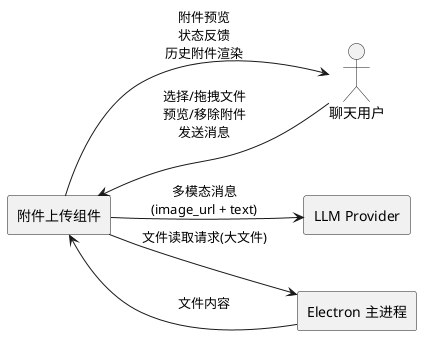
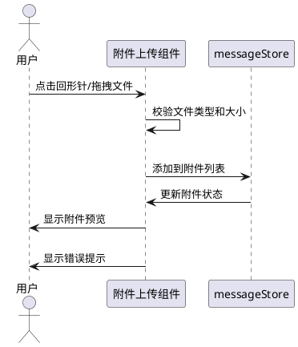
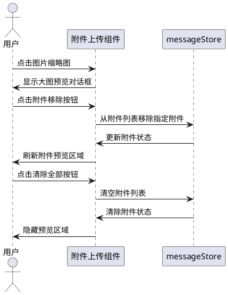
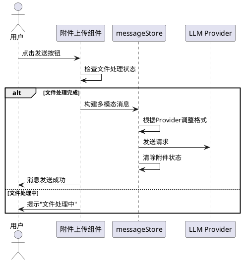
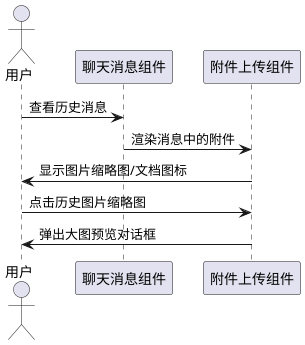

# 1. 组件定位

## 1.1 核心职责

本组件负责在聊天对话中管理文件的附加、预览与发送，实现多文件作为附件随消息一起发送给 LLM 的核心价值。

## 1.2 核心输入

1. **用户文件选择操作**：用户通过点击回形针按钮或拖拽方式选择本地文件
2. **用户文件移除操作**：用户在发送前移除已添加的附件
3. **用户消息发送操作**：用户发送包含附件的聊天消息
4. **用户附件预览操作**：用户点击附件缩略图查看大图或文件详情

## 1.3 核心输出

1. **附件列表渲染**：在输入框上方展示当前已添加的附件缩略图/文件图标列表
2. **多模态消息**：将附件与文本组合为 OpenAI Chat Completions 兼容的多模态 content 数组发送给 LLM
3. **历史消息中的附件展示**：在聊天记录中正确渲染历史消息的附件内容
4. **文件处理状态反馈**：文件过大、格式不支持等异常情况的提示信息

## 1.4 职责边界

1. **不负责**：文件的持久化存储（附件不落盘，仅在内存中处理）
2. **不负责**：LLM 端的文件理解与解析（由 LLM Provider 负责）
3. **不负责**：MCP 工具的文件操作（由 MCP 协议层负责）
4. **不负责**：Agent 卡片中的参考文件上传（已有独立实现）
5. **不负责**：技能包/插件包的上传安装（已有独立实现）
6. **不负责**：`v-file-input` 组件本身的渲染细节（经评估 `v-file-input + hide-input + @click.stop` 组合会破坏文件选择委托，已替换为自定义 `v-btn + <input type="file">` 实现）
7. **渐进式迁移期**：当前 `panel-header` 旁 `chat-mcp-chat-thumbnail-strip`（按钮旁 32×32 行内缩略图）与 `v-textarea` 内 `attachment-chip-strip`（80×80 卡片条被替换为 chip 标签条）并存，迁移完成后下线 chip 条，仅保留行内缩略图条。

# 2. 领域术语

**附件（Attachment）**
: 用户在聊天消息中附加的本地文件，包括图片和文档，随消息一起发送给 LLM。

**附件列表（Attachment List）**
: 当前待发送消息中已添加的所有附件的集合，展示在输入框上方的预览区域。

**图片附件（Image Attachment）**
: 图片类型的附件，支持预览缩略图，发送时以 base64 编码的 image_url 形式嵌入消息。

**文档附件（Document Attachment）**
: 非图片类型的文件附件，发送时以提取的文本内容或文件描述嵌入消息。

**多模态消息（Multimodal Message）**
: 包含多种内容类型（图片、文本、文档内容）的聊天消息，采用 OpenAI Chat Completions 兼容的 content 数组格式。

# 3. 角色与边界

## 3.1 核心角色

**聊天用户**：在对话中附加文件、预览附件、发送包含附件的消息、查看历史消息中的附件。

## 3.2 外部系统

**LLM Provider**：接收包含附件的多模态消息，处理图片和文档内容。
**Electron 主进程**：提供文件系统访问能力（如需读取大文件）。

## 3.3 交互上下文

# 4. DFX约束

## 4.1 性能

1. 单张图片压缩后大小不得超过 1MB，压缩处理应在 2 秒内完成
2. 附件列表渲染不应阻塞输入框的键盘输入响应，响应时间不超过 100ms
3. 单次消息的附件总大小（编码后）不得超过 20MB，避免超出 LLM API 限制

## 4.2 可靠性

1. 文件处理过程中发生错误时，不应导致消息发送失败或对话状态异常
2. 附件数据仅保存在内存中（Pinia Store），页面刷新后附件数据不保留，此为预期行为

## 4.3 安全性

1. 文件选择器应限制可接受的文件类型，禁止上传可执行文件（.exe、.bat、.sh 等）
2. 文件内容仅在本地处理，不得上传至第三方服务器（仅通过 LLM API 发送）

## 4.4 可维护性

1. 文件处理逻辑应与消息发送逻辑解耦，便于独立测试和修改
2. 附件相关的状态管理应集中在 messageStore 中，与现有 Store 架构一致

## 4.5 兼容性

1. 多模态消息格式必须兼容 OpenAI Chat Completions API 的 content 数组规范
2. 必须兼容 Anthropic、GLM、Qwen 等已接入 Provider 的多模态消息格式差异
3. 现有单文件上传功能应平滑过渡到多文件附件模式，不破坏已有对话历史

# 5. 核心能力

## 5.1 附件添加

### 5.1.1 业务规则

1. **多文件选择规则**：用户应当能通过文件选择器一次选择多个文件，也可多次追加文件

   a. 验收条件：[用户点击回形针按钮并选择多个文件] → [所有选中文件均添加到附件列表]

2. **拖拽添加规则**：用户应当能通过拖拽文件到输入区域添加附件

   a. 验收条件：[用户拖拽文件到聊天输入区域] → [文件添加到附件列表并显示预览]

3. **文件类型限制规则**：系统必须仅接受以下文件类型：图片（jpg、jpeg、png、gif、webp、bmp、svg）、文档（doc、docx、ppt、pptx、xls、xlsx、txt、pdf、md、csv）

   a. 验收条件：[用户选择不在支持列表中的文件类型] → [文件不被添加，系统显示"不支持的文件类型"提示]

4. **文件大小限制规则**：单个文件大小不得超过 10MB

   a. 验收条件：[用户选择超过 10MB 的文件] → [文件不被添加，系统显示"文件大小超过限制"提示]

5. **附件数量限制规则**：单次消息的附件数量不得超过 10 个

   a. 验收条件：[附件列表已有 10 个文件时用户尝试添加新文件] → [系统显示"附件数量已达上限"提示，新文件不被添加]

6. **重复文件检测规则**：系统应当检测同名同大小的文件并提示用户

   a. 验收条件：[用户添加与附件列表中已有文件同名同大小的文件] → [系统显示"文件已存在"提示，由用户确认是否重复添加]

7. **禁止项**：禁止上传可执行文件、脚本文件等可能存在安全风险的文件类型

   a. 验收条件：[用户选择 .exe/.bat/.sh/.cmd/.ps1 等文件] → [文件被拒绝，系统显示安全提示]

### 5.1.2 交互流程

### 5.1.3 异常场景

1. **文件读取失败**

   a. 触发条件：文件选择后读取内容时发生 I/O 错误或文件被占用

   b. 系统行为：跳过该文件，不影响其他附件的处理

   c. 用户感知：显示"文件读取失败，请重试"提示

2. **图片压缩失败**

   a. 触发条件：Canvas 绘制图片时发生错误（如损坏的图片文件）

   b. 系统行为：尝试以原始 base64 发送，若原始数据过大则跳过

   c. 用户感知：显示"图片处理异常"提示

3. **文档解析失败**

   a. 触发条件：mammoth 解析 docx 文件失败或文件编码无法识别

   b. 系统行为：将文件名和类型作为附件元数据保留，文本内容置空

   c. 用户感知：显示"文档内容无法解析，将以文件名发送"提示

## 5.2 附件预览与管理

### 5.2.1 业务规则

1. **图片预览规则**：图片类型的附件必须显示缩略图预览

   a. 验收条件：[用户添加图片文件] → [在输入框上方显示图片缩略图]

2. **文档图标规则**：文档类型的附件必须显示文件类型图标和文件名

   a. 验收条件：[用户添加 docx 文件] → [显示 Word 图标 + 文件名]

3. **附件移除规则**：用户应当能逐个移除已添加的附件

   a. 验收条件：[用户点击附件上的移除按钮] → [该附件从列表中移除，其余附件位置调整]

4. **全部清除规则**：用户应当能一键清除所有附件

   a. 验收条件：[用户点击清除全部按钮] → [所有附件被移除，预览区域隐藏]

5. **大图预览规则**：用户点击图片缩略图时应当显示大图预览

   a. 验收条件：[用户点击图片缩略图] → [弹出图片放大对话框，可查看原图细节]

6. **附件排序规则**：附件应当按照添加顺序排列

   a. 验收条件：[用户依次添加文件 A、B、C] → [附件列表按 A→B→C 顺序显示]

7. **禁止项**：禁止在消息发送后修改或删除已发送消息中的附件

   a. 验收条件：[消息已发送后用户尝试修改附件] → [操作不被允许，附件作为消息的一部分不可变]

### 5.2.2 交互流程

### 5.2.3 异常场景

1. **缩略图生成失败**

   a. 触发条件：图片文件损坏或格式不标准导致无法生成缩略图

   b. 系统行为：显示默认图片占位图标

   c. 用户感知：缩略图区域显示占位图标，不影响消息发送

## 5.3 附件消息发送

### 5.3.1 业务规则

1. **多模态消息构建规则**：当消息包含图片附件时，系统必须构建 OpenAI Chat Completions 兼容的 content 数组格式

   a. 验收条件：[消息包含 2 张图片和文本] → [构建 content 数组：[image_url, image_url, text]]

2. **文档内容嵌入规则**：当消息包含文档附件时，系统必须将文档提取的文本内容嵌入消息文本中

   a. 验收条件：[消息包含 1 个 docx 附件和文本] → [消息文本格式为"[Word Document: filename.docx]\n\n文档内容\n\n用户文本"]

3. **混合附件消息规则**：当消息同时包含图片和文档附件时，图片以 image_url 形式嵌入 content 数组，文档文本拼接到 text 部分

   a. 验收条件：[消息包含 1 张图片 + 1 个 docx + 文本] → [content 数组：[image_url, text（含文档内容+用户文本）]]

4. **纯附件消息规则**：用户应当能仅发送附件而不输入文本

   a. 验收条件：[用户添加附件但不输入文本后点击发送] → [消息正常发送，文本部分自动补充文件描述]

5. **发送后清理规则**：消息发送成功后，系统必须自动清除附件列表和预览区域

   a. 验收条件：[包含附件的消息发送成功] → [附件列表清空，预览区域隐藏，输入框恢复初始状态]

6. **Provider 兼容性规则**：系统必须根据当前选择的 LLM Provider 调整多模态消息格式

   a. 验收条件：[当前 Provider 为 Anthropic] → [图片以 Anthropic 格式嵌入消息]
   b. 验收条件：[当前 Provider 不支持多模态] → [图片转为文本描述，文档内容正常嵌入]

7. **禁止项**：禁止在文件处理未完成时发送消息

   a. 验收条件：[图片正在压缩或文档正在解析时用户点击发送] → [发送按钮禁用，显示"文件处理中"提示]

### 5.3.2 交互流程

### 5.3.3 异常场景

1. **Provider 不支持多模态**

   a. 触发条件：当前选择的 LLM Provider 不支持图片输入

   b. 系统行为：将图片附件转为文本描述（如"[图片: filename.jpg]"），文档内容正常嵌入

   c. 用户感知：发送的消息中图片以文本替代，系统提示"当前模型不支持图片，已转为文本描述"

2. **附件总大小超限**

   a. 触发条件：所有附件编码后的总大小超过 LLM API 限制（如 20MB）

   b. 系统行为：阻止发送，提示用户减少附件数量或文件大小

   c. 用户感知：显示"附件总大小超过限制，请减少附件"提示

3. **消息发送失败**

   a. 触发条件：LLM API 返回错误（如 token 超限、请求格式错误）

   b. 系统行为：保留附件列表和输入文本，允许用户修改后重试

   c. 用户感知：显示错误信息，附件和文本不丢失

## 5.4 历史消息附件展示

### 5.4.1 业务规则

1. **历史图片展示规则**：历史消息中的图片附件必须以缩略图形式展示，点击可放大

   a. 验收条件：[用户查看包含图片的历史消息] → [图片以缩略图显示，点击可弹出大图预览]

2. **历史文档展示规则**：历史消息中的文档附件必须以文件类型图标 + 文件名形式展示

   a. 验收条件：[用户查看包含文档的历史消息] → [显示文件类型图标和文件名标签]

3. **多附件展示规则**：历史消息中的多个附件必须以横向滚动列表或网格形式展示

   a. 验收条件：[历史消息包含 5 张图片] → [图片以网格形式展示，可横向滚动查看]

4. **禁止项**：禁止从历史消息中下载或导出附件（附件为 base64 编码，不提供下载功能）

   a. 验收条件：[用户右键点击历史消息中的图片] → [不提供"另存为"选项]

### 5.4.2 交互流程

### 5.4.3 异常场景

1. **历史图片数据损坏**

   a. 触发条件：历史消息中的 base64 图片数据不完整或损坏

   b. 系统行为：显示图片加载失败的占位图标

   c. 用户感知：图片区域显示占位图标，不影响其他消息内容展示

# 6. 数据约束

## 6.1 附件对象（Attachment）

1. **id**：附件的唯一标识，必须为 UUID 格式，由系统自动生成
2. **file**：原始 File 对象引用，必须为浏览器 File 类型
3. **name**：文件名，必须为非空字符串，长度不超过 255 个字符
4. **type**：文件 MIME 类型，必须符合 accept 列表中定义的类型范围
5. **size**：文件大小（字节），必须大于 0 且不超过 10MB（10485760 字节）
6. **category**：文件分类，必须为 "image" 或 "document" 之一
7. **thumbnail**：缩略图数据（仅图片类型），为 base64 编码的 Data URL 字符串
8. **status**：处理状态，必须为 "pending"（待处理）、"processing"（处理中）、"ready"（就绪）、"error"（错误）之一
9. **textContent**：文档提取的文本内容（仅文档类型），为字符串，可为空

## 6.2 多模态消息内容项（Content Item）

1. **type**：内容类型，必须为 "text"、"image_url" 之一
2. **text**：文本内容（type 为 text 时），必须为非空字符串
3. **image_url**：图片 URL 对象（type 为 image_url 时），包含 url 字段，为 base64 Data URL 格式

## 6.3 附件列表（Attachment List）

1. **最大数量**：单次消息的附件数量不得超过 10 个
2. **总大小限制**：所有附件编码后的总大小不得超过 20MB
3. **排序规则**：按添加顺序排列，先添加的排在前面
4. **唯一性**：通过附件 id 保证唯一性，允许同名文件（不同 id）