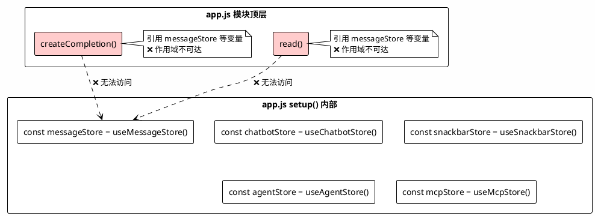
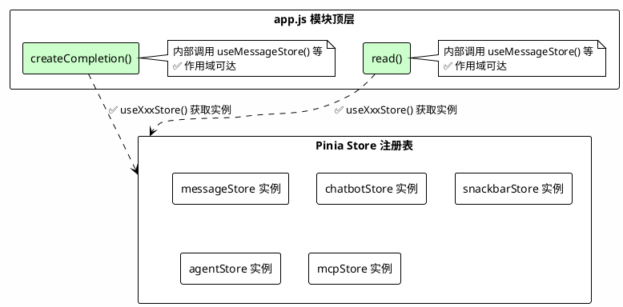
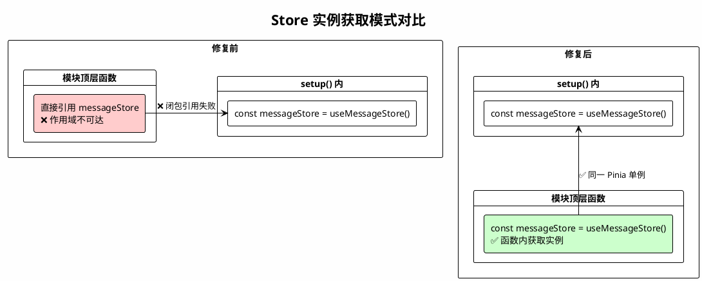

# **1. 实现模型**

## **1.1 上下文视图**

### **1.1.1 问题上下文**

当前 `app.js` 中存在变量作用域引用错误：`createCompletion`（第426行）和 `read`（第520行）为模块顶层函数，其内部引用了 `messageStore`、`chatbotStore`、`snackbarStore`、`agentStore`、`mcpStore` 等变量，但这些变量均在 `setup()` 函数内部（第653行起）声明为局部变量。模块顶层函数无法访问 `setup()` 内的局部变量，导致运行时抛出 `ReferenceError`。



### **1.1.2 修复后上下文**

修复后，`createCompletion` 和 `read` 函数内部通过 `useXxxStore()` 直接获取 Store 实例，与 `stores.js` 中 action 内部的引用模式保持一致。



## **1.2 服务/组件总体架构**

### **1.2.1 修复前后对比**

| 维度 | 修复前 | 修复后 |
|------|--------|--------|
| Store 引用方式 | 闭包变量（`setup()` 局部变量） | 函数内部调用 `useXxxStore()` |
| 作用域可达性 | ❌ 模块顶层函数无法访问 | ✅ 函数内部直接获取 |
| 与 stores.js 一致性 | ❌ 不一致 | ✅ 一致 |
| Store 实例唯一性 | 依赖闭包传递 | Pinia 保证单例 |

### **1.2.2 修复范围**

仅涉及 `src/renderer/js/app.js` 中的两个模块顶层函数：

1. **`createCompletion`**（第426-510行）：需修复 `messageStore`、`chatbotStore`、`snackbarStore`、`agentStore`、`mcpStore` 的引用
2. **`read`**（第520-578行）：需修复 `messageStore` 的引用

> **注意**：`parseJson`（第586行）和 `parseTool`（第616行）虽也是模块顶层函数，但它们仅引用 `chatbotStore`，同样存在作用域问题。本次修复一并处理。

## **1.3 实现设计文档**

### **1.3.1 修复策略：函数内部调用 `useXxxStore()`**

**核心原则**：在模块顶层函数内部，通过调用 `useXxxStore()` 获取 Store 实例，而非依赖 `setup()` 中的闭包变量。

**依据**：Pinia 的 `useXxxStore()` 函数在 Store 注册完成后，每次调用均返回同一个响应式实例（单例模式）。`stores.js` 中的 action 已广泛采用此模式（如 `useSnackbarStore()`、`useMcpStore()` 等）。

### **1.3.2 变更清单**

#### **变更 1：`createCompletion` 函数**

**位置**：`app.js` 第426-510行

**修改内容**：在函数体开头添加 Store 实例获取语句，替换所有闭包变量引用。

```javascript
// 修改前（第426-439行）
const createCompletion = async (rawconversation) => {
    const conversation = rawconversation.reduce((newConversation, item) => {
        // ...
    }, []);

    try {
        messageStore.generating = true        // ❌ 闭包变量
        if (!chatbotStore.apiKey) {           // ❌ 闭包变量
            snackbarStore.showErrorMessage(…); // ❌ 闭包变量
```

```javascript
// 修改后
const createCompletion = async (rawconversation) => {
    const messageStore = useMessageStore();
    const chatbotStore = useChatbotStore();
    const snackbarStore = useSnackbarStore();
    const agentStore = useAgentStore();
    const mcpStore = useMcpStore();

    const conversation = rawconversation.reduce((newConversation, item) => {
        // ...
    }, []);

    try {
        messageStore.generating = true        // ✅ 函数内局部变量
        if (!chatbotStore.apiKey) {           // ✅ 函数内局部变量
            snackbarStore.showErrorMessage(…); // ✅ 函数内局部变量
```

**受影响引用点**（均在 `createCompletion` 内）：

| 行号 | 原引用 | 修复后 |
|------|--------|--------|
| 439 | `messageStore.generating = true` | 不变（引用来源变为函数内局部变量） |
| 441 | `chatbotStore.apiKey` | 不变 |
| 442 | `snackbarStore.showErrorMessage(…)` | 不变 |
| 446 | `agentStore.promptMessage(…)` | 不变 |
| 449 | `mcpStore.listTools()` | 不变 |
| 450 | `chatbotStore._mcpTools = tools` | 不变 |
| 456-458 | `chatbotStore.mcp`、`chatbotStore._mcpTools` | 不变 |
| 463-467 | `chatbotStore.method` | 不变 |
| 469 | `chatbotStore.provider`、`chatbotStore.apiKey` | 不变 |
| 484 | `snackbarStore.showErrorMessage(…)` | 不变 |
| 490 | `snackbarStore.showErrorMessage(…)` | 不变 |
| 493 | `messageStore.conversation.push(…)` | 不变 |
| 502 | `messageStore.conversation.at(-1)`、`chatbotStore.stream` | 不变 |
| 505 | `snackbarStore.showErrorMessage(…)` | 不变 |
| 508 | `messageStore.generating = false` | 不变 |

#### **变更 2：`read` 函数**

**位置**：`app.js` 第520-578行

**修改内容**：在函数体开头添加 `messageStore` 实例获取语句。

```javascript
// 修改前（第520-524行）
const read = async (reader, target, buffer, stream, currentEvent) => {
    const decoder = new TextDecoder();
    const { done, value } = await reader.read();

    if (done || !messageStore.generating) {   // ❌ 闭包变量
        messageStore.generating = false;       // ❌ 闭包变量
```

```javascript
// 修改后
const read = async (reader, target, buffer, stream, currentEvent) => {
    const messageStore = useMessageStore();

    const decoder = new TextDecoder();
    const { done, value } = await reader.read();

    if (done || !messageStore.generating) {   // ✅ 函数内局部变量
        messageStore.generating = false;       // ✅ 函数内局部变量
```

**受影响引用点**：

| 行号 | 原引用 | 修复后 |
|------|--------|--------|
| 524 | `messageStore.generating` | 不变（引用来源变为函数内局部变量） |
| 525 | `messageStore.generating = false` | 不变 |

#### **变更 3：`parseJson` 函数**

**位置**：`app.js` 第586行

**修改内容**：在函数体开头添加 `chatbotStore` 实例获取语句。

```javascript
// 修改前
const parseJson = (content, target, sseEvent) => {
    try {
        const parsed = JSON.parse(content)
        if (chatbotStore.provider === 'anthropic-compatible' && sseEvent) {  // ❌ 闭包变量
```

```javascript
// 修改后
const parseJson = (content, target, sseEvent) => {
    const chatbotStore = useChatbotStore();

    try {
        const parsed = JSON.parse(content)
        if (chatbotStore.provider === 'anthropic-compatible' && sseEvent) {  // ✅ 函数内局部变量
```

**受影响引用点**：

| 行号 | 原引用 | 修复后 |
|------|--------|--------|
| 589 | `chatbotStore.provider` | 不变 |
| 592 | `chatbotStore.provider` | 不变 |

#### **变更 4：`parseTool` 函数**

**位置**：`app.js` 第616行

**当前代码审查**：`parseTool` 函数内部未直接引用任何 Store 变量，无需修改。

### **1.3.3 `setup()` 内变量保留策略**

`setup()` 内的 `messageStore`、`chatbotStore` 等变量声明**保留不变**，原因如下：

1. `setup()` 返回的对象中包含这些 Store 的引用，供模板绑定使用
2. 其他 `setup()` 内部定义的函数（如 `triggerFilePicker`、`onFilePickerChange` 等）通过闭包正确访问这些变量
3. 删除这些声明会导致模板绑定和其他闭包函数失效

### **1.3.4 实例唯一性保证**

Pinia 的 `useXxxStore()` 在同一应用生命周期内始终返回同一个响应式实例。因此：

- `createCompletion` 内部通过 `useMessageStore()` 获取的实例，与 `setup()` 内通过 `useMessageStore()` 获取的实例是**同一个对象**
- `startInference` action（在 `stores.js` 中）调用 `createCompletion` 时，两者操作的 `messageStore` 状态完全一致
- 这与 `stores.js` 中 action 内部调用 `useSnackbarStore()`、`useMcpStore()` 的模式完全相同

### **1.3.5 不变更清单**

| 项目 | 原因 |
|------|------|
| `stores.js` 中 `useMessageStore` 的定义 | 无需修改 Store 定义 |
| `stores.js` 中 action 内的 Store 引用方式 | 已符合目标模式 |
| `setup()` 内的 Store 变量声明 | 模板绑定和闭包函数仍需使用 |
| `components.js` 中的 Store 引用 | 在 `setup()` 内正确使用，无作用域问题 |
| Store 的 state/getters/actions 接口 | 修复不改变对外 API |

# **2. 接口设计**

## **2.1 总体设计**

本次修复为纯内部实现变更，**不新增任何对外接口**，**不修改任何现有接口签名**。

修复仅改变模块顶层函数内部获取 Store 实例的方式（从闭包变量改为函数内调用 `useXxxStore()`），所有函数的入参、返回值、行为语义均保持不变。

## **2.2 接口清单**

### **2.2.1 `createCompletion` 函数**

| 属性 | 值 |
|------|-----|
| 签名 | `createCompletion(rawconversation: Array): Promise<void>` |
| 入参 | `rawconversation` - 原始对话消息数组 |
| 返回值 | `Promise<void>` |
| 变更类型 | **无变更**（仅内部实现调整） |

### **2.2.2 `read` 函数**

| 属性 | 值 |
|------|-----|
| 签名 | `read(reader: ReadableStreamDefaultReader, target: Object, buffer: string, stream: boolean, currentEvent?: string): Promise<void>` |
| 入参 | `reader` - 流读取器；`target` - 目标消息对象；`buffer` - 缓冲区；`stream` - 是否流式；`currentEvent` - SSE 事件类型 |
| 返回值 | `Promise<void>` |
| 变更类型 | **无变更**（仅内部实现调整） |

### **2.2.3 `parseJson` 函数**

| 属性 | 值 |
|------|-----|
| 签名 | `parseJson(content: string, target: Object, sseEvent: string): void` |
| 入参 | `content` - JSON 字符串；`target` - 目标消息对象；`sseEvent` - SSE 事件类型 |
| 返回值 | `void` |
| 变更类型 | **无变更**（仅内部实现调整） |

# **4. 数据模型**

## **4.1 设计目标**

本次修复不涉及数据模型变更。`messageStore` 的 state 结构、getters、actions 接口均保持不变。

## **4.2 模型实现**

### **4.2.1 Store 实例获取模式**

修复前后 Store 实例获取方式的对比：



### **4.2.2 messageStore 状态字段（无变更）**

| 字段 | 类型 | 说明 |
|------|------|------|
| `generating` | `boolean` | 是否正在生成回复 |
| `conversation` | `Array<Object>` | 对话消息列表 |
| `userMessage` | `string` | 用户输入消息 |
| `attachments` | `Array<Object>` | 附件列表 |
| `isProcessingFiles` | `boolean` | 是否正在处理文件 |
| `processingCount` | `number` | 正在处理的文件数量 |

### **4.2.3 createCompletion 依赖的 Store 状态映射**

| Store | 字段/方法 | 访问类型 | 用途 |
|-------|-----------|----------|------|
| `messageStore` | `generating` | 读/写 | 控制生成状态 |
| `messageStore` | `conversation` | 读/写 | 追加助手消息 |
| `chatbotStore` | `apiKey` | 读 | 验证 API Key |
| `chatbotStore` | `provider` | 读 | 确定请求适配方式 |
| `chatbotStore` | `method` | 读 | HTTP 请求方法 |
| `chatbotStore` | `mcp` | 读 | 是否启用 MCP |
| `chatbotStore` | `_mcpTools` | 读/写 | MCP 工具列表 |
| `chatbotStore` | `stream` | 读 | 是否流式请求 |
| `snackbarStore` | `showErrorMessage()` | 调用 | 显示错误提示 |
| `agentStore` | `promptMessage()` | 调用 | 构建提示消息 |
| `mcpStore` | `listTools()` | 调用 | 获取 MCP 工具列表 |