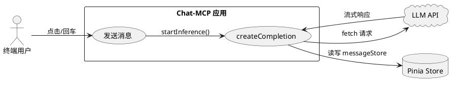
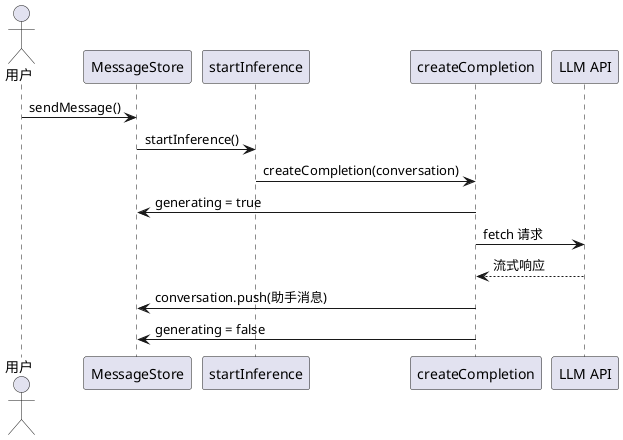

# **1. 组件定位**

## **1.1 核心职责**

本组件负责修复消息发送流程中 `messageStore` 变量作用域引用错误，确保对话补全请求能正确访问消息状态存储。

## **1.2 核心输入**

1. 用户发送消息操作（键盘回车 / 点击发送按钮）
2. `createCompletion` 函数对 `messageStore` 的状态读写请求

## **1.3 核心输出**

1. 消息发送流程正常执行，无 `ReferenceError` 异常
2. `messageStore.generating` 状态正确更新
3. `messageStore.conversation` 正确追加助手回复消息

## **1.4 职责边界**

- 本组件**不负责**消息内容的业务逻辑变更
- 本组件**不负责** LLM API 请求/响应的协议调整
- 本组件**不负责** Pinia Store 的结构重构

# **2. 领域术语**

**messageStore**
: Pinia 定义的消息状态存储实例，管理对话消息列表、生成状态、附件等数据。

**createCompletion**
: 模块级异步函数，负责构建 LLM API 请求并处理流式响应，内部需读写 `messageStore` 的状态。

**变量作用域引用**
: 函数访问外部变量的能力。当函数定义在模块顶层而变量声明在函数内部（如 Vue `setup()`）时，函数无法访问该变量，导致 `ReferenceError`。

**startInference**
: `useMessageStore` 的 action 方法，作为消息发送流程的入口，调用 `createCompletion` 发起推理请求。

# **3. 角色与边界**

## **3.1 核心角色**

- **终端用户**：通过键盘或按钮触发消息发送，期望收到 LLM 回复

## **3.2 外部系统**

- **LLM API 服务**：接收对话补全请求，返回流式响应
- **Pinia 状态管理**：提供 `messageStore` 实例的创建与访问机制

## **3.3 交互上下文**

# **4. DFX约束**

## **4.1 性能**

- 修复后消息发送流程的响应延迟不得超过修复前的水平（即修复不得引入额外性能开销）

## **4.2 可靠性**

- 修复后消息发送成功率必须达到 100%（在 API 服务正常的前提下），不得出现因变量引用导致的运行时异常

## **4.3 安全性**

- 无新增安全约束

## **4.4 可维护性**

- `messageStore` 的引用方式必须与项目中其他 Store（`chatbotStore`、`snackbarStore`、`agentStore`、`mcpStore`）的引用方式保持一致，便于统一维护

## **4.5 兼容性**

- 修复不得改变 `messageStore` 对外暴露的 API 接口（state、getters、actions）
- 不得影响模板中 `messageStore` 的现有绑定

# **5. 核心能力**

## **5.1 消息发送流程变量引用修复**

### **5.1.1 业务规则**

1. **变量可访问性规则**：`createCompletion` 函数必须能够正确访问 `messageStore` 实例

   a. 验收条件：When 用户发送消息触发 `startInference`，the 消息发送系统 shall 在 `createCompletion` 函数内成功读取 `messageStore.generating` 和 `messageStore.conversation`，不抛出 `ReferenceError`

2. **状态写入规则**：`createCompletion` 函数必须能够正确写入 `messageStore` 的状态字段

   a. 验收条件：When `createCompletion` 开始执行，the 消息发送系统 shall 将 `messageStore.generating` 设置为 `true`

   b. 验收条件：When `createCompletion` 获取到流式响应，the 消息发送系统 shall 向 `messageStore.conversation` 追加助手消息对象

   c. 验收条件：When `createCompletion` 执行完毕（无论成功或失败），the 消息发送系统 shall 将 `messageStore.generating` 设置为 `false`

3. **引用一致性规则**：`messageStore` 的获取方式必须与 `chatbotStore`、`snackbarStore`、`agentStore`、`mcpStore` 等其他 Store 的获取方式保持一致

   a. 验收条件：When 检查 `createCompletion` 函数中所有 Store 的引用方式，the 消息发送系统 shall 确保所有 Store 使用相同的实例获取模式

4. **禁止项**：禁止在 `createCompletion` 函数内部重新创建 `messageStore` 实例（如重复调用 `useMessageStore()`），必须复用已有的 Store 实例

   a. 验收条件：When `createCompletion` 执行，the 消息发送系统 shall 使用与 `startInference` action 相同的 `messageStore` 实例，确保状态一致性

### **5.1.2 交互流程**

### **5.1.3 异常场景**

1. **messageStore 未定义异常**

   a. 触发条件：`createCompletion` 函数内引用的 `messageStore` 变量不在当前作用域内

   b. 系统行为：抛出 `ReferenceError: messageStore is not defined`，消息发送流程中断

   c. 用户感知：消息发送后无回复，控制台输出错误信息

2. **API Key 缺失**

   a. 触发条件：`createCompletion` 执行时 `chatbotStore.apiKey` 为空

   b. 系统行为：显示错误提示 "API Key is required"，提前返回

   c. 用户感知：Snackbar 显示 API Key 缺失提示

3. **流式响应解析失败**

   a. 触发条件：`completion.body.getReader()` 返回空值

   b. 系统行为：显示解析失败提示

   c. 用户感知：Snackbar 显示流解析失败提示

4. **LLM API 请求失败**

   a. 触发条件：fetch 返回非 2xx 状态码

   b. 系统行为：解析错误信息并显示

   c. 用户感知：Snackbar 显示 HTTP 状态码和错误信息

# **6. 数据约束**

## **6.1 messageStore 实例引用**

1. **引用来源**：`messageStore` 必须通过 `useMessageStore()` 获取，且获取时机必须在 Pinia Store 注册完成之后

2. **引用位置**：`messageStore` 的获取位置必须在 `createCompletion` 函数的可访问作用域内

3. **实例唯一性**：同一 Vue 应用生命周期内，`useMessageStore()` 必须返回同一个响应式实例

## **6.2 createCompletion 函数依赖的 Store 状态**

1. **generating**：布尔值，标识是否正在生成回复，`createCompletion` 必须在开始时设为 `true`，结束时设为 `false`

2. **conversation**：消息数组，`createCompletion` 必须在获取流式响应后向其追加 `{ content, reasoning_content, tool_calls, role: "assistant" }` 对象